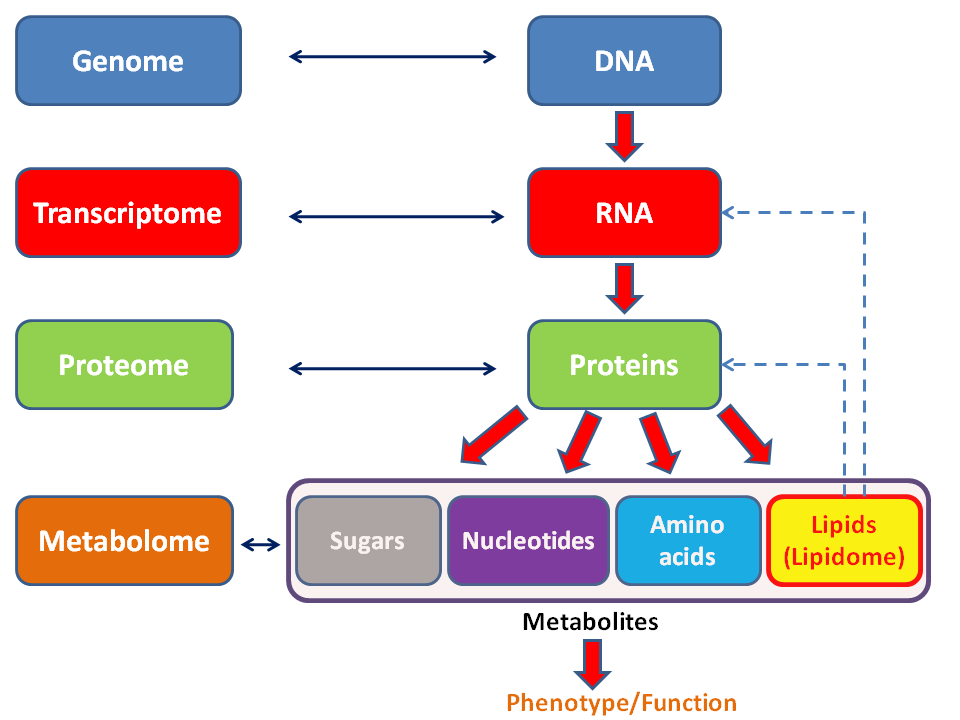
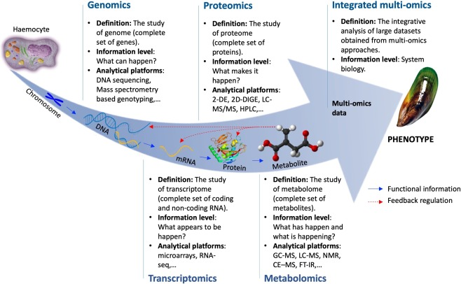

# Introduction

The branches of science known informally as omics are various disciplines in biology whose names end in the suffix __-omics__, such as **genomics**, **proteomics**, **metabolomics**, **metagenomics** and **transcriptomics**... Omics aims at the collective characterization and quantification of pools of biological molecules that translate into the structure, function, and dynamics of an organism or organisms.

```{r, fig.align="center", out.width="50%", echo=FALSE}

```

---
# Introduction

```{r, fig.align="center", out.width="70%", echo=FALSE}

```

---

# Program

.pull-left[
### First steps with NGS data (8 March)
  - Claude Thermes
  - Valentin Loux
  - Olivier Rué

### Good practices in Bioinformatics (10 March)
  - Valentin Loux
  - Olivier Rué
  
### Genome arithmetic (25 march)
  - Matthias Zynticki
  - Olivier Rué
]
  
.pull-right[
### Proteomics (10 March)
  - Thibault Léger

### Transcriptomics (24 March)
  - Marc Deloger
  - Nicolas Servant

### Metabolomics (22 March)
  - Binta Diémé
  - Mélanie Pétéra
]

---

# Resources

All teaching materials are available here:
- [https://du-bii.github.io/accueil/](https://du-bii.github.io/accueil/)

# Need help

[Slack](dubii.slack.com) is the most appropriate place to ask questions concerning courses.
