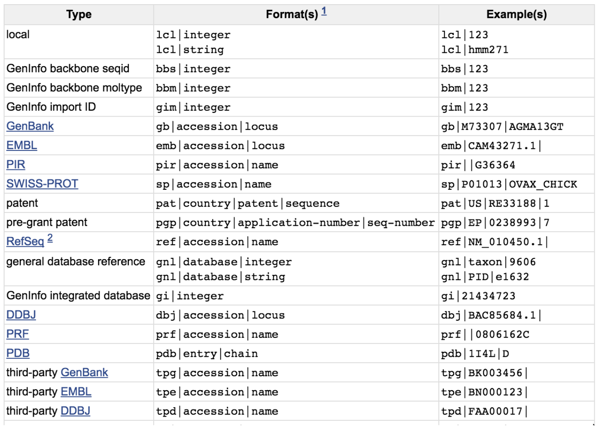

```{r setup, include=FALSE}
options(htmltools.dir.version = FALSE)
library(RefManageR)
BibOptions(check.entries = FALSE, bib.style = "authoryear", style = "markdown",
           dashed = TRUE)
file.name <- "biblio.bib"
bib <- ReadBib(file.name)
```

# Program

- Introduction (5 min)
- Get data from public resources (30 min)
- FASTQ format
- Quality control (45 min)
- Cleaning of reads (30 min)
- Mapping of reads (30 min)
- FASTA format
- SAM format

<!-- 
Total : 2h 35

-->
---
# Preparation of your working directory

## Instruction

- Go in your home directory
- Create a directory called MODULE5_TP1
- Move in this directory

## Correction

```{bash}
cd ~/
mkdir MODULE5_TP1
cd MODULE5_TP1
```

---
class: heading-slide, middle, center
# The Data

---

# What is data

## Definition

- `Data` is <i>a symbolic representation of information</i>
- `Data` is stored in files whose format allows an easy way to access and manipulate
- `Data` represent the knowledge at a given time.

## Properties

- The same information may be represented in different formats
- The content depends on technologies

<div class="alert comment">Understanding data formats, what information is encoded in each, and when it
is appropriate to use one format over another is an essential skill of a bioinfor-
matician.</div>

---

# Storage and accessibility of data

## Primary analyses

- Sequencing data are often available. It is a prerequite for publishing results.

## Expertized data

- Some repositories exist, often dedicated to a particular organism

---

# DNA sequences resources

The International Nucleotide Sequence Database Collaboration (INSDC) is a long-standing foundational initiative that operates between DDBJ, EMBL-EBI and NCBI. INSDC covers the spectrum of data raw reads, through alignments and assemblies to functional annotation, enriched with contextual information relating to samples and experimental configurations.

```{r, fig.align="center", out.width="70%", fig.cap= "INDSC resources" , echo=FALSE}
knitr::include_graphics("images/public_resources.png")
```

---
# DNA sequences resources

The member organizations of this collaboration are:
- NCBI: National Center for Biotechnology Information
- EMBL: European Molecular Biology Laboratory
- DDBJ: DNA Data Bank of Japan

The INSDC has set up rules on the types of data that will be mirrored. The most important
of these from a bioinformatician’s perspective are:
- GenBank/Ebi ENA contains all annotated and identified DNA sequence information
- SRA [NCBI Sequence Reads Archive](https://trace.ncbi.nlm.nih.gov/Traces/sra/) / ENA [European Nucleotide Archive](https://www.ebi.ac.uk/ena/browser/search): Short Read Archive contains measurements from high throughput sequencing
experiments (raw data)
- UniProt: Universal Protein Resource is the most authoritative repository of protein
sequence data.
- Protein Data Bank (PDB) is the major repository of 3D structural information about
biological macromolecules (proteins and nucleic acids). PDB contains structures for a spectrum of biomolecules - from small bits of proteins/nucleic acids all the way to
complex molecular structures like ribosomes.

---
# DNA sequences resources

## List of most resources

Once a year the journal Nucleic Acids Research publishes its so-called “database issue”. Each
article of this issue of the journal will provide and overview and updates about a specific
database written by the maintainers of that resource.
- View the NAR: 2019 Database Issue.

```{r, fig.align="center", out.width="50%", fig.cap= "NAR 2019 database issue overview" , echo=FALSE}
knitr::include_graphics("images/NAR_db.png")
```

---
class: heading-slide, middle, center
# Get Data

---
# Get data

## Sequencing data

- Tools or API are offered to easily get data locally
- ENA: enaBrowserTools (command line, python, R)
- NCBI: sra-toolkit (command line, python, R)

## Data from FTP servers or HTTP

- wget / ftp command lines


---
# Get data

We will focus on data associated with this article:

```{r, fig.align="center", out.width="70%", fig.cap= "Allué-Guardia A et al. 2019. Microbiol Resour Announc 8:e01052-18. https://doi.org/10.1128/MRA.01052-18." , echo=FALSE}
knitr::include_graphics("images/MRA.01052-18.png")
```

- Short reads from Illumina

---
# TP1 : Get Data

## Instruction

- In the "Data availability" section, extract the accession for Illumina data : SRX4909245
- Explore [SRA](https://www.ncbi.nlm.nih.gov/sra/SRX4909245) and [ENA](https://www.ebi.ac.uk/ena/browser/view/SRX4909245)

Get the data by the method of your choice: via the web browser, <code>wget</code> or <code>fastq-dump</code>

--

## Correction

```{bash, eval=FALSE, class="large"}
wget ftp://ftp.sra.ebi.ac.uk/vol1/fastq/SRR808/003/SRR8082143/SRR8082143_1.fastq.gz
wget ftp://ftp.sra.ebi.ac.uk/vol1/fastq/SRR808/003/SRR8082143/SRR8082143_2.fastq.gz
```
or
```{bash, eval=FALSE, class="large"}
# conda env list |grep sra-tools
source activate sra-tools-2.10.0
fastq-dump --split-3 SRR8082143 --gzip
conda deactivate
```


---
class: heading-slide, middle, center
# File formats

---

# FASTA

The FASTA format is used to represent sequence information. The format is very simple:
- A <code>></code> symbol on the FASTA header line indicates a fasta record start.
- A string of letters called the sequence id may follow the <code>></code> symbol.
- The header line may contain an arbitrary amount of text (including spaces) on the
same line.
- Subsequent lines contain the sequence.

--

<i>Example</i>

```{bash, eval=FALSE}
>foo
ATGCC
>bar other optional text could go here
CCGTA
>bidou
ACTGCAGT
TTCGN
>repeatmasker
ATGTGTcggggggATTTT
>prot2; my_favourite_prot
MTSRRSVKSGPREVPRDEYEDLYYTPSSGMASP
```

---

# FASTA

The lack of a definition of the FASTA format and its apparent simplicity can be a source of
some of the most confounding errors in bioinformatics. Since the format appears so exceed-
ingly straightforward, software developers have been tacitly assuming that the properties
they are accustomed to are required by some standard - whereas no such thing exists. 

## Common problems

- Some tools need 60 characters per line
- Some tools ignore anything following the first space in the header line
- Some tools are very restrictive on the alphabet used
- Some tools require uppercase letters

---

# FASTA

## Good practices

The sequence lines should always wrap at the same width (with the exception of the
last line). Some tools will fail to operate correctly and may not even warn the users if
this condition is not satisfied. The following is technically a valid FASTA but it may
cause various subtle problems.

```{bash, eval=FALSE}
>foo
ATGCATGCATGCATGCATGC
ATGCATGCA
TGATGCATGCATGCATGCA
```

should be reformated to

```{bash, eval=FALSE}
>foo
ATGCATGCATGCATGCATGC
ATGCATGCATGATGCATGCA
TGCATGCA
```

<i>Can be easily to with seqkit tool</i>

```{bash, eval=FALSE}
seqkit seq -w 60 seqs.fa > seqs2.fa
```

---

# FASTA

Some data repositories will format FASTA headers to include structured information. Tools
may operate differently when this information is present in the FASTA header. Below is a list of the
recognized FASTA header formats.

```{r, fig.align="center", out.width="50%", fig.cap= "FASTA header examples" , echo=FALSE}

```

---

# FASTA

## Seqkit

```{bash, eval=FALSE, class="large"}
[orue@migale work]$ seqkit seq -h
transform sequences (revserse, complement, extract ID...)

Usage:
  seqkit seq [flags]

Flags:
  -p, --complement                complement sequence (blank for Protein sequence)
      --dna2rna                   DNA to RNA
  -G, --gap-letters string        gap letters (default "- \t.")
  -h, --help                      help for seq
  -l, --lower-case                print sequences in lower case
  -M, --max-len int               only print sequences shorter than the maximum length (-1 for no limit) (default -1)
  -m, --min-len int               only print sequences longer than the minimum length (-1 for no limit) (default -1)
  -n, --name                      only print names
  -i, --only-id                   print ID instead of full head
  -q, --qual                      only print qualities
  -g, --remove-gaps               remove gaps
  -r, --reverse                   reverse sequence
      --rna2dna                   RNA to DNA
  -s, --seq                       only print sequences
  -u, --upper-case                print sequences in upper case
  -v, --validate-seq              validate bases according to the alphabet
  -V, --validate-seq-length int   length of sequence to validate (0 for whole seq) (default 10000)

Global Flags:
      --alphabet-guess-seq-length int   length of sequence prefix of the first FASTA record based on which seqkit guesses the sequence type (0 for whole seq) (default 10000)
      --id-ncbi                         FASTA head is NCBI-style, e.g. >gi|110645304|ref|NC_002516.2| Pseud...
      --id-regexp string                regular expression for parsing ID (default "^([^\\s]+)\\s?")
  -w, --line-width int                  line width when outputing FASTA format (0 for no wrap) (default 60)
  -o, --out-file string                 out file ("-" for stdout, suffix .gz for gzipped out) (default "-")
      --quiet                           be quiet and do not show extra information
  -t, --seq-type string                 sequence type (dna|rna|protein|unlimit|auto) (for auto, it automatically detect by the first sequence) (default "auto")
  -j, --threads int                     number of CPUs. (default value: 1 for single-CPU PC, 2 for others) (default 2)

```

---
# Sequencing data - Glossary

.pull-left[
**Read** :  piece of sequenced DNA

**DNA fragment** = 1 or more reads depending on whether the sequencing is single end or paird-end

**Insert** = Fragment size

**Depth** = $N*L/G$ 
N= number of reads, L = size, G : genome size

**Coverage** = % of genome covered
]
.pull-right[
```{r, fig.align="center", out.width="90%", fig.cap= "Single-End , Paired-End" , echo=FALSE}
knitr::include_graphics("images/se-pe.png")
```

```{r, fig.align="center", out.width="90%", fig.cap= "Single-End , Paired-End" , echo=FALSE}
knitr::include_graphics("images/fragment-insert.png")
```

```{r, fig.align="center", out.width="90%", fig.cap= "Single-End , Paired-End" , echo=FALSE}
knitr::include_graphics("images/depth-breadth.png")
```

]

---


# FASTQ

The FASTQ format is the de facto standard by which all sequencing instruments represent
data. It may be thought of as a variant of the FASTA format that allows it to associate a
quality measure to each sequence base, FASTA with QUALITIES.

In simpler terms, it is a format where for every base, we associate a reliability measure:
base is A and the probability that we are wrong is 1/1000.

---

# FASTQ

The FASTQ format consists of 4 sections:
1. A FASTA-like header, but instead of the <code>></code> symbol it uses the <code>@</code> symbol. This is followed
by an ID and more optional text, similar to the FASTA headers.
2. The second section contains the measured sequence (typically on a single line), but it
may be wrapped until the <code>+</code> sign starts the next section.
3. The third section is marked by the <code>+</code> sign and may be optionally followed by the same
sequence id and header as the first section
4. The last line encodes the quality values for the sequence in section 2, and must be of
the same length as section 2.

<i>Example</i>

```{bash, eval=FALSE}
@SEQ_ID
GATTTGGGGTTCAAAGCAGTATCGATCAAATAGTAAATCCATTTGTTCAACTCACAGTTT
+
!''*((((***+))%%%++)(%%%%).1***-+*''))**55CCF>>>>>>CCCCCCC65
```

---

# FASTQ

The weird characters in the 4th section are the so called “encoded” numerical values.
In a nutshell, each character represents a numerical value: a so-called Phred score,
encoded via a single letter encoding.

```{bash, eval=FALSE}
!"#$%&'()*+,-./0123456789:;<=>?@ABCDEFGHI
|    |    |    |    |    |    |    |    |
0....5...10...15...20...25...30...35...40
|    |    |    |    |    |    |    |    |
worst................................best
```

The quality values of the FASTQ files are on top. The numbers in the middle of the scale
from 0 to 40 are called Phred scores. The numbers represent the error probabilities in a
somewhat convoluted manner via the formula:

Error=10ˆ(-P/10) basically summarized as:

- P=0 means 1/1 (100% error)
- P=10 means 1/10 (10% error)
- P=20 means 1/100 (1% error)
- P=30 means 1/1000 (0.1% error)
- P=40 means 1/10000 (0.01% error)

---

# FASTQ

<div class="alert comment">`r icon::fa("exclamation-circle")` There are different versions of the FASTQ encoding</div>

There was a time when instrumentation makers could not decide at what
character to start the scale. The current standard shown above is the so-called Sanger (+33)
format where the ASCII codes are shifted by 33. There is the so-called +64 format that
starts close to where the other scale ends.

```{r, fig.align="center", out.width="80%", fig.cap= "FASTQ encoding values" , echo=FALSE}
knitr::include_graphics("images/qualityscore.png")
```

---

# FASTQ 

```{bash, eval=FALSE, class="large"}
[orue@migale work]$ seqtk seq

Usage:   seqtk seq [options] <in.fq>|<in.fa>

Options: -q INT    mask bases with quality lower than INT [0]
         -X INT    mask bases with quality higher than INT [255]
         -n CHAR   masked bases converted to CHAR; 0 for lowercase [0]
         -l INT    number of residues per line; 0 for 2^32-1 [0]
         -Q INT    quality shift: ASCII-INT gives base quality [33]
         -s INT    random seed (effective with -f) [11]
         -f FLOAT  sample FLOAT fraction of sequences [1]
         -M FILE   mask regions in BED or name list FILE [null]
         -L INT    drop sequences with length shorter than INT [0]
         -F CHAR   fake FASTQ quality []
         -c        mask complement region (effective with -M)
         -r        reverse complement
         -A        force FASTA output (discard quality)
         -C        drop comments at the header lines
         -N        drop sequences containing ambiguous bases
         -1        output the 2n-1 reads only
         -2        output the 2n reads only
         -V        shift quality by '(-Q) - 33'
         -U        convert all bases to uppercases
         -S        strip of white spaces in sequences
```

```{bash, eval=FALSE}
seqtk seq -Q64 input.fq > output.fq
```

---

# FASTQ - Header informations

Just as with FASTA headers, information is often encoded in the “free” text section of a
FASTQ file.

<code>@EAS139:136:FC706VJ:2:2104:15343:197393 1:Y:18:ATCACG</code> contains the following information:

- <code>EAS139</code>: the unique instrument name
- <code>136</code>: the run id
- <code>FC706VJ</code>: the flowcell id
- <code>2</code>: flowcell lane
- <code>2104</code>: tile number within the flowcell lane
- <code>15343</code>: ‘x’-coordinate of the cluster within the tile
- <code>197393</code>: ‘y’-coordinate of the cluster within the tile
- <code>1</code>: the member of a pair, 1 or 2 (paired-end or mate-pair reads only)
- <code>Y</code>: Y if the read is filtered, N otherwise
- <code>18</code>: 0 when none of the control bits are on, otherwise it is an even number
- <code>ATCACG</code>: index sequence

This information is specific to a particular instrument/vendor and may change with different
versions or releases of that instrument.
---

# Quality control

## Why do a QC of your read ?

Answer to (not always) simple question :
--

Do the generated sequences conform to the expected level of performance?
- Size
- Number of reads
- Quality
- Residual presence of adapters or indexes ?
- Techincal biases (expected and unexpected) ?

<div class="alert comment">`r icon::fa("exclamation-circle")` It is the knowledge of what you expect that should guide you on what you are looking for</div>

---
# QC : software

- [FastQC](http://www.bioinformatics.babraham.ac.uk/projects/fastqc/)   `r Citep(bib, "fastqc")` **Quality Control for FastQ files**
  - QC for (Illumina) FastQ files
  - Command line fastqc or graphical interface
  - Complete HTML report to spot problem originating from sequencer, library preparation, contamination
  - Summary graphs and tables to quickly assess your data
  
  
```{r, fig.align="center", out.width="40%", fig.cap= "FastQC software" , echo=FALSE}
knitr::include_graphics("images/fastqc.png")
```
  
---

---
# TP2 - Quality Control

Run FastQC on each of the FASTQ files you previsouly downloaded and download the HTML files on your local computer to visualize them.

```{bash, eval=FALSE}
source activate fastqc-0.11.8 # load fastqc tool
mkdir FASTQC # create output directory
for i in *.gz ; do srun --cpus=8 --cpus-per-task=8 fastqc $i -t 8 -o FASTQC ; done
conda deactivate
```

```{bash, eval=FALSE}
scp login@core.cluster.france-bioinformatique.fr:/~/MODULE5_TP1/FASTQC/*.html .
```


---
FastQC : some metrics
Quality, GC, Adpatater 
---
# Read Cleaning
Objectives 
- filetr / clean
- remove adptaters

Tools :
- sickle, trimmomatic, …
- All in one : fastp
---
# Practical : read cleaning

---
# Practical : one report 
multiqQC

---
class: heading-slide, middle, center
# Mapping

---
# Mapping

- Map short reads to a reference genome is predict the locus where a read comes from.
- The result of a mapping is the list of the most probable regions with an associated probability.

--

<div class="alert comment">`r icon::fa("exclamation-circle")` But what is a reference?</div>

---
# Reference

---

...


---
# Alignment strategies

```{bash, eval=FALSE}
GAAGCTCTAGGATTACGATCTTGATCGCCGGGAAATTATGATCCTGACCTGAGTTTAAGGCATGGACCCATAA
                 ATCTTGATCGCCGAC----ATT              # GLOBAL
                 ATCTTGATCGCCGACATT                  # LOCAL, with soft clipping
```

## Global alignment

Global alignments, which attempt to align every residue in every sequence, are most useful when the sequences in the query set are similar and of roughly equal size. (This does not mean global alignments cannot start and/or end in gaps.) A general global alignment technique is the <code>Needleman–Wunsch algorithm</code>, which is based on dynamic programming.

## Local alignment

Local alignments are more useful for dissimilar sequences that are suspected to contain regions of similarity or similar sequence motifs within their larger sequence context. The <code>Smith–Waterman algorithm</code> is a general local alignment method based on the same dynamic programming scheme but with additional choices to start and end at any place.

---
# Alignment strategies

Seed-and-extend mappers are a class of read mappers that break down each read sequence into seeds (i.e., smaller segments) to find locations in the reference genome that closely match the read

.pull-left[
1. First, the mapper obtains a read
2. Second, the mapper selects smaller DNA segments from the read to
serve as seeds
3. Third, the mapper indexes a data structure with each seed to
obtain a list of possible locations within the reference genome that could result in
a match
4. Fourth, for each possible location in the list, the mapper obtains the
corresponding DNA sequence from the reference genome
5. Fifth, the mapper aligns the read sequence to the reference sequence, using an expensive sequence
alignment (i.e., verification) algorithm to determine the similarity between the read
sequence and the reference sequence.
]
.pull-right[
```{r, fig.align="center", out.width="90%", fig.cap= "" , echo=FALSE}
knitr::include_graphics("images/seed_and_extend.png")
```
]
---
# Mapping tools

```{r, fig.align="center", out.width="70%", fig.cap="" , echo=FALSE}
knitr::include_graphics("images/mapping_tools.png")
```

- Short reads: BWA `r Citep(bib, "bwa")`/ BOWTIE `r Citep(bib, "bowtie2")`

---
# TP4 - Mapping

## Instruction

- Map the reads to the reference genome located at <code></code>

## Correction

```{bash, eval=FALSE}
source activate bwa
srun bwa index sequence.fasta
srun bwa mem sequence.fasta 
```


---
# SAM / BAM formats

The SAM/BAM formats are so-called Sequence Alignment Maps. These files typically represent
the results of aligning a FASTQ file to a reference FASTA file and describe the individual,
pairwise alignments that were found. Different algorithms may create different alignments
(and hence BAM files)

```{r, fig.align="center", out.width="70%", fig.cap="" , echo=FALSE}
knitr::include_graphics("images/SAM_format.jpg")
```


---
# Samtools
Swiss-knife for operating of SAM/BAM format

samtools view
samtools flagstat

---
# What about Long Reads

---


# Bibliography

```{r, results='asis', echo=FALSE}
PrintBibliography(bib)
```