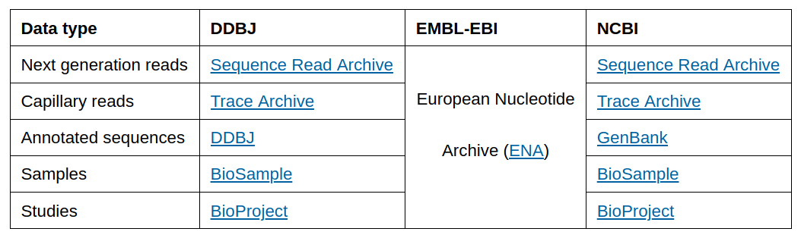
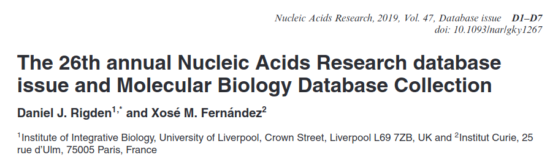
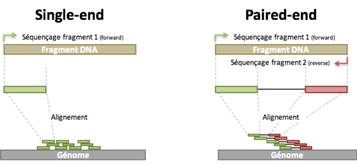
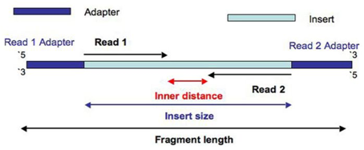

```{r setup, include=FALSE}
options(htmltools.dir.version = FALSE)
library(RefManageR)
BibOptions(check.entries = FALSE, bib.style = "authoryear", style = "markdown",
           dashed = TRUE)
file.name <- "biblio.bib"
bib <- ReadBib(file.name)
```

# Program

- Introduction (5 min)
- Getting raw NGS data from public resources (30 min)
  - FASTQ format
  - A first glimpse on NGS data
- Quality control (45 min)
- Reads cleaning & filtering (30 min)
- Mapping of reads (30 min)
- FASTA format
- SAM format

<!-- 
Total : 2h 35

-->
---
class: heading-slide, middle, center
# The Data

---

# What is data

## Definition

- `Data` is <i>a symbolic representation of information</i>
- `Data` is stored in files whose format allows an easy way to access and manipulate
- `Data` represent the knowledge at a given time.

## Properties

- The same information may be represented in different formats
- The content depends on technologies

<div class="alert comment">Understanding data formats, what information is encoded in each, and when it
is appropriate to use one format over another is an essential skill of a bioinfor-
matician.</div>

---

# Genomics sequences resources

The International Nucleotide Sequence Database Collaboration (INSDC) is a long-standing foundational initiative that operates between DDBJ, EMBL-EBI and NCBI. INSDC covers the spectrum of data raw reads, through alignments and assemblies to functional annotation, enriched with contextual information relating to samples and experimental configurations.

```{r, fig.align="center", out.width="70%", fig.cap= "INDSC resources" , echo=FALSE}

```

---
#  International Nucleotide Sequence Database Collaboration

The member organizations of this collaboration are:
- NCBI: National Center for Biotechnology Information
- EMBL: European Molecular Biology Laboratory
- DDBJ: DNA Data Bank of Japan

The INSDC has set up rules on the types of data that will be mirrored. The most important
of these from a bioinformatician’s perspective are:
- GenBank/Ebi ENA contains all annotated and identified DNA sequence information
- SRA [NCBI Sequence Reads Archive](https://trace.ncbi.nlm.nih.gov/Traces/sra/) / ENA [European Nucleotide Archive](https://www.ebi.ac.uk/ena/browser/search): Short Read Archive contains measurements from high throughput sequencing
experiments (raw data)


Deposit of sequencing (raw) and processed (analyzed) datas are (most of the time) a prerequiste for publication.


---
# Other sequence resources

## NAR Database Issue

Once a year the journal Nucleic Acids Research publishes its so-called “database issue”. Each
article of this issue of the journal will provide an overview of generic and specific
databases written by the maintainers of that resource.
- View the NAR: 2019 Database Issue.

```{r, fig.align="center", out.width="50%", fig.cap= "NAR 2019 database issue overview" , echo=FALSE}

```

---
class: heading-slide, middle, center
# Getting raw Data

---
# Getting raw data

## Sequencing data

- Specialized Tools or API are offered by the public repository to easily get data locally
- ENA: enaBrowserTools (command line, python, R)
- NCBI: sra-toolkit (command line, python, R)

Common command lines (wget) are most of the time also available


---
# Hands-on : Get Data

Get the raw short read data (Illumina) associated with this article.


```{r, fig.align="center", out.width="70%", fig.cap= "Allué-Guardia A et al. 2019. Microbiol Resour Announc 8:e01052-18. https://doi.org/10.1128/MRA.01052-18." , echo=FALSE}
knitr::include_graphics("images/MRA.01052-18.png")
```


---
#  Hands-on : Get Data

- In the "Data availability" section, extract the accession for Illumina data : SRX4909245
- Explore [SRA](https://www.ncbi.nlm.nih.gov/sra/SRX4909245) and [ENA](https://www.ebi.ac.uk/ena/browser/view/SRX4909245)

Get the data by the method of your choice.

- Direct download via the web browser

- Using wget :
```{bash, eval=FALSE, class="large"}
wget ftp://ftp.sra.ebi.ac.uk/vol1/fastq/SRR808/003/SRR8082143/SRR8082143_1.fastq.gz
wget ftp://ftp.sra.ebi.ac.uk/vol1/fastq/SRR808/003/SRR8082143/SRR8082143_2.fastq.gz
```
- Using a dedicated tool sra-toolkit or enaBrowserTool
```{bash, eval=FALSE, class="large"}

mkdir DATA

module load  sra-tools
srun fasterq-dump   -S -p  SRR8082143


module load  enabrowsertools
srun enaDataGet -f fastq SRR8082143 
 
```


---
# Sequencing  - Vocabulary

.pull-left[
**Read** :  piece of sequenced DNA

**DNA fragment** = 1 or more reads depending on whether the sequencing is single end or paird-end

**Insert** = Fragment size

**Depth** = $N*L/G$ 
N= number of reads, L = size, G : genome size

**Coverage** = % of genome covered
]
.pull-right[
```{r, fig.align="center", out.width="80%",  echo=FALSE}

```

```{r, fig.align="center", out.width="80%", , echo=FALSE}

```

```{r, fig.align="center", out.width="80%", fig.cap= "Single-End , Paired-End" , echo=FALSE}
knitr::include_graphics("images/depth-breadth.png")
```

]

---


# FASTQ

The FASTQ format is the de facto standard by which all sequencing instruments represent
data. It may be thought of as a variant of the FASTA format that allows it to associate a
quality measure to each sequence base:   **FASTA with QUALITIES**.


The FASTQ format consists of 4 sections:
1. A FASTA-like header, but instead of the <code>></code> symbol it uses the <code>@</code> symbol. This is followed
by an ID and more optional text, similar to the FASTA headers.
2. The second section contains the measured sequence (typically on a single line), but it
may be wrapped until the <code>+</code> sign starts the next section.
3. The third section is marked by the <code>+</code> sign and may be optionally followed by the same
sequence id and header as the first section
4. The last line encodes the quality values for the sequence in section 2, and must be of
the same length as section 2.

<i>Example</i>

```{bash, eval=FALSE}
@SEQ_ID
GATTTGGGGTTCAAAGCAGTATCGATCAAATAGTAAATCCATTTGTTCAACTCACAGTTT
+
!''*((((***+))%%%++)(%%%%).1***-+*''))**55CCF>>>>>>CCCCCCC65
```

---

# FASTQ

The weird characters in the 4th section are the so called “encoded” numerical values.
In a nutshell, each character represents a numerical value: a so-called Phred score,
encoded via a single letter encoding.

```{bash, eval=FALSE}
!"#$%&'()*+,-./0123456789:;<=>?@ABCDEFGHI
|    |    |    |    |    |    |    |    |
0....5...10...15...20...25...30...35...40
|    |    |    |    |    |    |    |    |
worst................................best
```

The quality values of the FASTQ files are on top. The numbers in the middle of the scale
from 0 to 40 are called Phred scores. The numbers represent the error probabilities  via the formula:

Error=10ˆ(-P/10) 
It is basically summarized as:

- P=0 means 1/1 (100% probability of error)
- P=10 means 1/10 (10% probability of error)
- P=20 means 1/100 (1% probability of error)
- P=30 means 1/1000 (0.1% probability of error)
- P=40 means 1/10000 (0.01% probability of error)

---

# FASTQ encoding

There was a time when instrumentation makers could not decide at what
character to start the scale. The **current standard** shown above is the so-called Sanger (+33)
format where the ASCII codes are shifted by 33. There is the so-called +64 format that
starts close to where the other scale ends.


```{r, fig.align="center", out.width="80%", fig.cap= "FASTQ encoding values" , echo=FALSE}
knitr::include_graphics("images/qualityscore.png")
```

---

# FASTQ conversion

```{bash, eval=FALSE, class="large"}
[orue@migale work]$ seqtk seq

Usage:   seqtk seq [options] <in.fq>|<in.fa>

Options: -q INT    mask bases with quality lower than INT [0]
         -X INT    mask bases with quality higher than INT [255]
         -n CHAR   masked bases converted to CHAR; 0 for lowercase [0]
         -l INT    number of residues per line; 0 for 2^32-1 [0]
         -Q INT    quality shift: ASCII-INT gives base quality [33]
         -s INT    random seed (effective with -f) [11]
         -f FLOAT  sample FLOAT fraction of sequences [1]
         -M FILE   mask regions in BED or name list FILE [null]
         -L INT    drop sequences with length shorter than INT [0]
         -F CHAR   fake FASTQ quality []
         -c        mask complement region (effective with -M)
         -r        reverse complement
         -A        force FASTA output (discard quality)
         -C        drop comments at the header lines
         -N        drop sequences containing ambiguous bases
         -1        output the 2n-1 reads only
         -2        output the 2n reads only
         -V        shift quality by '(-Q) - 33'
         -U        convert all bases to uppercases
         -S        strip of white spaces in sequences
```

```{bash, eval=FALSE}
seqtk seq -Q64 input.fq > output.fq
```

---

# FASTQ - Header informations

Just as with FASTA headers, information is often encoded in the “free” text section of a
FASTQ file.

<code>@EAS139:136:FC706VJ:2:2104:15343:197393 1:Y:18:ATCACG</code> contains the following information:

- <code>EAS139</code>: the unique instrument name
- <code>136</code>: the run id
- <code>FC706VJ</code>: the flowcell id
- <code>2</code>: flowcell lane
- <code>2104</code>: tile number within the flowcell lane
- <code>15343</code>: ‘x’-coordinate of the cluster within the tile
- <code>197393</code>: ‘y’-coordinate of the cluster within the tile
- <code>1</code>: the member of a pair, 1 or 2 (paired-end or mate-pair reads only)
- <code>Y</code>: Y if the read is filtered, N otherwise
- <code>18</code>: 0 when none of the control bits are on, otherwise it is an even number
- <code>ATCACG</code>: index sequence

This information is specific to a particular instrument/vendor and may change with different
versions or releases of that instrument.
---

# Quality control

## Why QC'ing your reads ?

**Try to answer to (not always) simple questions :**
--

- Do the generated sequences conform to the expected level of performance?
  - Size
  - Number of reads
  - Quality
- Residual presence of adapters or indexes ?
- Are there (un)expected techincal biases
- Arte ther (un)expected biological biases

<div class="alert comment">`r icon::fa("exclamation-circle")` A QC without context is a bad QC</div>

---
# QC : software

- [FastQC](http://www.bioinformatics.babraham.ac.uk/projects/fastqc/)   `r Citep(bib, "fastqc")` **Quality Control for FastQ files**
  - QC for (Illumina) FastQ files
  - Command line fastqc or graphical interface
  - Complete HTML report to spot problem originating from sequencer, library preparation, contamination
  - Summary graphs and tables to quickly assess your data
  
  
```{r, fig.align="center", out.width="40%", fig.cap= "FastQC software" , echo=FALSE}
knitr::include_graphics("images/fastqc.png")
```
  

---
# Hands-on : QC

- Launch FastQC on the paired-end FastQ files of the sample you previously downloaded
- Inspect the results
  - Are the number coherent with the article ?
  - Comment on the quality of the sequencing
--

```{bash, eval=FALSE, class="large"}
mkdir QC
  srun fastqc DATA/SRR8082143_1.fastq.gz -o QC/
  srun fastqc DATA/SRR8082143_2.fastq.gz -o QC/
```


---
# Read Cleaning
Objectives 
- Detect and remove sequencing adapters (still) present in the FastQ files
- Filter / trim reads according to quality (as plotted in FastQC)

Tools :
- Simple & fast : Sickle (quality), cutadapt (adpater removal)
- Ultra-configurable : Trimmomatic
- All in one & ultra-fast : [fastp](https://github.com/OpenGene/fastp)


```{r, fig.align="center", out.width="60%", fig.cap= "FASTQ encoding values" , echo=FALSE}
knitr::include_graphics("images/fastp_wkwf.png")
```


---
#  Hands-on : read cleaning with fastp
- Launch fastp on the paired-end FastQ files of the sample you previously downloaded
  - Detect and Remove the classical Illumina adapters
  - Filter reads with :
      - mean quality >= 20 on a sliding window of 4
      -  40% of the bases with a quality >= 15
      - length of the trimmed read >= 100

- Inspect the results
  - How many reads are filtered ?
  - Where do fastp store its reports. is it configurable ?
--

```{bash, eval=FALSE, class="large"}
  module load fastp
 mkdir FASTP
  srun fastp -i DATA/SRR8082143_1.fastq.gz -I DATA/SRR8082143_2.fastq.gz -l 100 -o FASTP/SRR8082143_1.cleaned_filtered.fastq.gz -O FASTP/SRR8082143_2.cleaned_filtered.fastq.gz --unpaired1  FASTP/SRR8082143_singles.fastq.gz -w 1 -j FASTP/fastp.json -h FASTP/fastp.html
```
---
# Hands-on : One report to rule them all 
.pull-left[
[MultiqQC](https://multiqc.info) allow the aggregation of individual reports from FastQC, Fastp, Trimmomactic, Cutadapt and much more
- 78 tools included
- Aggregate all analysis in one report :
  - by tool
  - in one graphe aggregating samples
  ]
.pull-right[
```{r, fig.align="center", out.width="30%", fig.cap= "MultiQC tools" , echo=FALSE}
knitr::include_graphics("images/multiqc-tools.png")
```
]

```{r, fig.align="center", out.width="100%", fig.cap= "MultiQC Report Example" , echo=FALSE}
knitr::include_graphics("images/multiqc-example.png")
```


---
# Mapping

- BWA / BOWTIE `r Citep(bib, "bwa")`
- TP

```{r, fig.align="center", out.width="70%", fig.cap="" , echo=FALSE}
knitr::include_graphics("images/mapping_tools.png")
```

---
# SAM / BAM formats

The SAM/BAM formats are so-called Sequence Alignment Maps. These files typically represent
the results of aligning a FASTQ file to a reference FASTA file and describe the individual,
pairwise alignments that were found. Different algorithms may create different alignments
(and hence BAM files)
---
# Samtools
Swiss-knife for operating of SAM/BAM format

samtools view
samtools flagstat

---
# What about Long Reads ?

As global quality and error models ar different, ,algorithms and tools are different for long reads. 

The raw read format is also different

- PacBio :
  - internal read correction
  - built in software for QC / correction
  - QC : nanoPlot(https://github.com/wdecoster/NanoPlot)
  - Correction (hybrid) : LorDec (http://www.atgc-montpellier.fr/lordec/)
  - Alignment minimap2(https://lh3.github.io/minimap2), BLASR(https://github.com/PacificBiosciences/blasr) 
- NanoPore :
  - Caution to basecaller / chemistry version !
  - QC : nanoPlot(https://github.com/wdecoster/NanoPlot)
  - Correction :Canu(https://github.com/marbl/canu), MECAT(https://github.com/xiaochuanle/MECAT)
  


---
# References

```{r, results='asis', echo=FALSE}
PrintBibliography(bib)
```