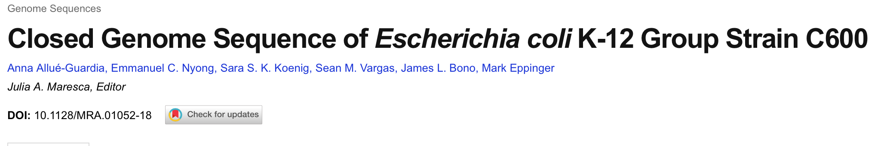
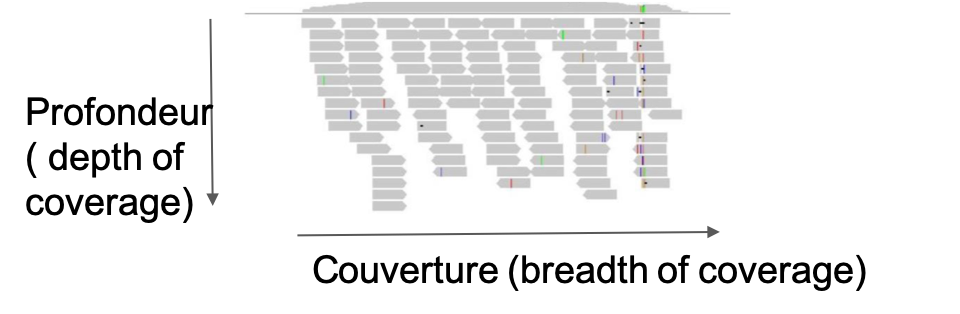
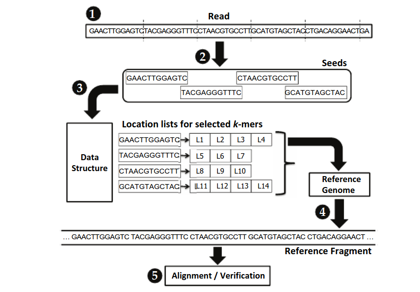
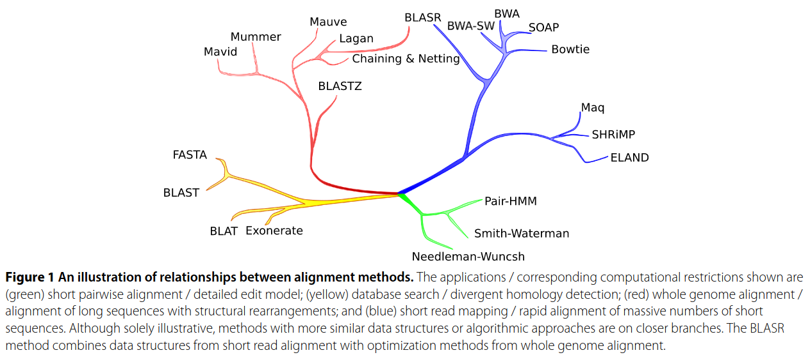

class: hide-logo

```{r setup, include=FALSE}
options(htmltools.dir.version = FALSE)
library(RefManageR)
library(icon)
#download_fontawesome()
BibOptions(check.entries = FALSE, bib.style = "authoryear", style = "markdown",
           dashed = TRUE)
file.name <- "biblio_slides.bib"
bib <- ReadBib(file.name)
```

# Program

- Introduction (5 min)
- Get data from public resources (30 min)
- FASTQ format
- Quality control (45 min)
- Cleaning of reads (30 min)
- Mapping of reads (30 min)
- FASTA format
- SAM format

<!-- 
Total : 2h 35
-->
---

class: tp

# Hands-on: Preparation of your working directory

## Instruction

- Switch to <a href="TP.html#1_Preparation_of_your_working_directory">TP document</a>
- Preparation of your working directory

---
class: heading-slide, middle, center
# The Data

---

# What is data

## Definition

- `Data` is <i>a symbolic representation of information</i>
- `Data` is stored in files whose format allows an easy way to access and manipulate
- `Data` represents the knowledge at a given time.

## Properties

- The same information may be represented in different formats
- The content depends on technologies

<div class="alert comment">`r fontawesome("exclamation-circle", style = "solid")` Understanding data formats, what information is encoded in each, and when it is appropriate to use one format over another is an essential skill of a bioinformatician.</div>

---

# Some NGS file formats

Format | Who generates it? | Who reads it?
--- | --- | ---
*FASTQ* | `sequencers`, `simulation tools` | `mapping tools`, `QC tools`, `cleaning tools`, `taxonomic assignation tools`
*FASTA* | `assembly tools`, `gene prediction tools` ... | `visualization tools`, almost all
*SAM/BAM* | `mapping tools`, `samtools` | `visualization tools`, `variant discovery tools`, `counting tools`
*BED* | `annotation tools`, `bedtools` | `visualization tools`, `variant discovery tools`, `peak calling tools`, `counting tools`
*GFF* | `annotation tools` | `visualization tools`, `variant discovery tools`, `peak calling tools`, `RNAseq tools`
*VCF* | `variant discovery tools` | `vcftools`,  `visualization tools`, `variant discovery tools`

* [synthesis](https://ressources.france-bioinformatique.fr/sites/default/files/formats.pdf)


---

# Genomics sequences resources

The International Nucleotide Sequence Database Collaboration (INSDC) is a long-standing foundational initiative that operates between DDBJ, EMBL-EBI and NCBI. INSDC covers the spectrum of data raw reads, through alignments and assemblies to functional annotation, enriched with contextual information relating to samples and experimental configurations.

```{r, fig.align="center", out.width="70%", fig.cap= "INDSC resources" , echo=FALSE}
knitr::include_graphics("images/public_resources.png")
```

---
# International Nucleotide Sequence Database Collaboration

The member organizations of this collaboration are:
- NCBI: National Center for Biotechnology Information
- EMBL: European Molecular Biology Laboratory
- DDBJ: DNA Data Bank of Japan

The INSDC has set up rules on the types of data that will be mirrored. The most important
of these from a bioinformatician’s perspective are:
- GenBank/Ebi ENA contains all annotated and identified DNA sequence information
- SRA [NCBI Sequence Reads Archive](https://trace.ncbi.nlm.nih.gov/Traces/sra/) / ENA [European Nucleotide Archive](https://www.ebi.ac.uk/ena/browser/search): Short Read Archive contains measurements from high throughput sequencing
experiments (raw data)


Deposit of sequencing (raw) and processed (analyzed) datas are (most of the time) a prerequiste for publication.

---
# Other sequence resources

## NAR Database Issue

Once a year the journal Nucleic Acids Research publishes its so-called “database issue”. Each
article of this issue of the journal will provide an overview of generic and specific
databases written by the maintainers of that resource.
- The 2021 Nucleic Acids Research database issue and the online molecular biology database collection

```{r, fig.align="center", out.width="50%", fig.cap= "NAR 2019 database issue overview" , echo=FALSE}
knitr::include_graphics("images/NAR_db.png")
```

---

class: heading-slide, middle, center
# Retrieving NGS data

---
# Retrieving NGS data

- Very easy when it concerns only a few files, can be done directly from the website
- Much more tricky for tens, hundreds, thousands...

## Sequencing data

- Specialized Tools or API are offered by the public repository to easily get data locally
- ENA: enaBrowserTools (command line, python, R)
- NCBI: sra-toolkit (command line, python, R)

Common command lines (wget) are most of the time also available.

---
class: tp

# Hands-on: Retrieving raw data 

## Instruction

Get the raw shot read data (Illumina) associated with this article `r Citep(bib, "Allue-Guardiae01052-18")`.

```{r, fig.align="center", out.width="70%", echo=FALSE}

```

- Switch to <a href="TP.html#2_Retrieve_raw_data_(FASTQ)">TP document</a>
- Retrieve raw data (FASTQ)

---

# Sequencing  - Vocabulary

- **read**: a single sequence produced from a sequencer. Think: a sequencing machine read a molecule and this is what it thinks it is.

- **library**: a collection of DNA fragments that have been prepared for sequencing. This is generally talking about individual samples.

- **flowcell**: a chip on which DNA is loaded and provided to the sequencer.

- **lane**: one portion of a flowcell. Usually used for technical replicates or different samples.

- **run**: an entire sequencing reaction from start to finish.

---
# Sequencing  - Vocabulary

.pull-left[
**Read** :  piece of sequenced DNA

**DNA fragment** = 1 or more reads depending on whether the sequencing is single end or paird-end

**Insert** = Fragment size

**Depth** = $N*L/G$ 
N= number of reads, L = size, G : genome size

**Coverage** = % of genome covered
]
.pull-right[
```{r, fig.align="center", out.width="80%",  echo=FALSE}
knitr::include_graphics("images/se-pe.png")
```

```{r, fig.align="center", out.width="80%", , echo=FALSE}
knitr::include_graphics("images/fragment-insert.png")
```

```{r, fig.align="center", out.width="80%", fig.cap= "Single-End , Paired-End" , echo=FALSE}

```

]
---
class: heading-slide, middle, center
# FASTQ format

---

# FASTQ syntax

The FASTQ format is the de facto standard by which all sequencing instruments represent
data. It may be thought of as a variant of the FASTA format that allows it to associate a
quality measure to each sequence base:   **FASTA with QUALITIES**.


The FASTQ format consists of 4 sections:
1. A FASTA-like header, but instead of the <code>></code> symbol it uses the <code>@</code> symbol. This is followed
by an ID and more optional text, similar to the FASTA headers.
2. The second section contains the measured sequence (typically on a single line), but it
may be wrapped until the <code>+</code> sign starts the next section.
3. The third section is marked by the <code>+</code> sign and may be optionally followed by the same
sequence id and header as the first section
4. The last line encodes the quality values for the sequence in section 2, and must be of
the same length as section 2.

<i>Example</i>

```{bash, eval=FALSE}
@SEQ_ID
GATTTGGGGTTCAAAGCAGTATCGATCAAATAGTAAATCCATTTGTTCAACTCACAGTTT
+
!''*((((***+))%%%++)(%%%%).1***-+*''))**55CCF>>>>>>CCCCCCC65
```

---

# FASTQ quality

The weird characters in the 4th section are the so called “encoded” numerical values.
In a nutshell, each character represents a numerical value: a so-called Phred score,
encoded via a single letter encoding.

```{bash, eval=FALSE}
!"#$%&'()*+,-./0123456789:;<=>?@ABCDEFGHI
|    |    |    |    |    |    |    |    |
0....5...10...15...20...25...30...35...40
|    |    |    |    |    |    |    |    |
worst................................best
```

The quality values of the FASTQ files are on top. The numbers in the middle of the scale
from 0 to 40 are called Phred scores. The numbers represent the error probabilities  via the formula:

Error=10ˆ(-P/10) 
It is basically summarized as:

- P=0 means 1/1 (100% probability of error)
- P=10 means 1/10 (10% probability of error)
- P=20 means 1/100 (1% probability of error)
- P=30 means 1/1000 (0.1% probability of error)
- P=40 means 1/10000 (0.01% probability of error)

---

# FASTQ quality encoding specificities

There was a time when instrumentation makers could not decide at what
character to start the scale. The **current standard** shown above is the so-called Sanger (+33)
format where the ASCII codes are shifted by 33. There is the so-called +64 format that
starts close to where the other scale ends.


```{r, fig.align="center", out.width="80%", fig.cap= "FASTQ encoding values" , echo=FALSE}
knitr::include_graphics("images/qualityscore.png")
```

---

# FASTQ Header informations

Information is often encoded in the "free" text section of a FASTQ file.


<code>@EAS139:136:FC706VJ:2:2104:15343:197393 1:Y:18:ATCACG</code> contains the following information:


- <code>EAS139</code>: the unique instrument name
- <code>136</code>: the run id
- <code>FC706VJ</code>: the flowcell id
- <code>2</code>: flowcell lane
- <code>2104</code>: tile number within the flowcell lane
- <code>15343</code>: ‘x’-coordinate of the cluster within the tile
- <code>197393</code>: ‘y’-coordinate of the cluster within the tile
- <code>1</code>: the member of a pair, 1 or 2 (paired-end or mate-pair reads only)
- <code>Y</code>: Y if the read is filtered, N otherwise
- <code>18</code>: 0 when none of the control bits are on, otherwise it is an even number
- <code>ATCACG</code>: index sequence

This information is specific to a particular instrument/vendor and may change with different
versions or releases of that instrument.

---

class: heading-slide, middle, center

# Quality control

---


## Why QC'ing your reads ?

**Try to answer to (not always) simple questions :**
--

- Are the generated sequences conform to the expected level of performance?
  - Size
  - Number of reads
  - Quality
- Residual presence of adapters or indexes ?
- Are there (un)expected technical biases?
- Are there (un)expected biological biases?

<div class="alert comment">`r fontawesome("exclamation-circle", style = "solid")` Quality control without context leads to misinterpretation</div>


---
# Quality control for FASTQ files

- FastQC `r Citep(bib, "fastqc")`
  - QC for (Illumina) FastQ files
  - Command line fastqc or graphical interface
  - Complete HTML report to spot problem originating from sequencer, library preparation, contamination
  - Summary graphs and tables to quickly assess your data

  
```{r, fig.align="center", out.width="40%", fig.cap= "FastQC software" , echo=FALSE}
knitr::include_graphics("images/fastqc.png")
```
  

---
class: tp

# Hands-on : Quality control

- Switch to <a href="TP.html#3_Quality_control">TP document</a>
- Quality control

---
class: heading-slide, middle, center
# Reads cleaning
---

## Objectives

- Detect and remove sequencing adapters (still) present in the FastQ files
- Filter / trim reads according to quality (as plotted in FastQC)

## Tools

- Simple & fast : Sickle `r Citep(bib, "sickle")` (quality), cutadapt `r Citep(bib, "cutadapt")` (adpater removal)
- Ultra-configurable : Trimmomatic `r Citep(bib, "trimmomatic")`
- All in one & ultra-fast : fastp `r Citep(bib, "fastp")`


```{r, fig.align="center", out.width="55%", fig.cap= "FASTQ encoding values" , echo=FALSE}
knitr::include_graphics("images/fastp_wkwf.png")
```


---
class: tp

#  Hands-on : reads cleaning with fastp

- Switch to <a href="TP.html#4_Reads_cleaning_with_fastp">TP document</a>
- Reads cleaning with fastp

---
class: heading-slide, middle, center
# Mapping

---
# Mapping

- Map short reads to a reference genome is predict the locus where a read comes from.
- The result of a mapping is the list of the most probable regions with an associated probability.

--

<div class="alert comment">`r fontawesome("exclamation-circle", style = "solid")` But what is a reference?</div>

---
# Reference

It can be everything containing DNA information:
- Complete genome
- Assembly
- Set of contigs
- Set of sequences
- Genes, non-coding RNA...

For mapping, references have to be stored in a <code>FASTA</code> file.

---
class: heading-slide, middle, center
# FASTA format

---
# Informations inside

The FASTA format is used to represent sequence information. The format is very simple:
- A <code>></code> symbol on the FASTA header line indicates a fasta record start.
- A string of letters called the sequence id may follow the <code>></code> symbol.
- The header line may contain an arbitrary amount of text (including spaces) on the
same line.
- Subsequent lines contain the sequence.

--

<i>Example</i>

```{bash, eval=FALSE}
>foo
ATGCC
>bar other optional text could go here
CCGTA
>bidou
ACTGCAGT
TTCGN
>repeatmasker
ATGTGTcggggggATTTT
>prot2; my_favourite_prot
MTSRRSVKSGPREVPRDEYEDLYYTPSSGMASP
```

---

# FASTA syntax

The lack of a definition of the FASTA format and its apparent simplicity can be a source of
some of the most confounding errors in bioinformatics. Since the format appears so exceed-
ingly straightforward, software developers have been tacitly assuming that the properties
they are accustomed to are required by some standard - whereas no such thing exists. 

## Common problems

- Some tools need 60 characters per line
- Some tools ignore anything following the first space in the header line
- Some tools are very restrictive on the alphabet used
- Some tools require uppercase letters
- seqkit `r Citep(bib, "shen2016seqkit")` saves your life

---

# FASTA formating

## Good practices

The sequence lines should always wrap at the same width (with the exception of the
last line). Some tools will fail to operate correctly and may not even warn the users if
this condition is not satisfied. The following is technically a valid FASTA but it may
cause various subtle problems.

```{bash, eval=FALSE}
>foo
ATGCATGCATGCATGCATGC
ATGCATGCA
TGATGCATGCATGCATGCA
```

should be reformated to

```{bash, eval=FALSE}
>foo
ATGCATGCATGCATGCATGC
ATGCATGCATGATGCATGCA
TGCATGCA
```

<i>Can be easily to with seqkit `r Citep(bib, "shen2016seqkit")`</i>

```{bash, eval=FALSE}
seqkit seq -w 60 seqs.fa > seqs2.fa
```

---

# FASTA Header

Some data repositories will format FASTA headers to include structured information. Tools
may operate differently when this information is present in the FASTA header. Below is a list of the
recognized FASTA header formats.

```{r, fig.align="center", out.width="50%", fig.cap= "FASTA header examples" , echo=FALSE}
knitr::include_graphics("images/FASTA_headers.png")
```

---
class: heading-slide, middle, center
# Alignment

---
# Alignment strategies

```{bash, eval=FALSE}
GAAGCTCTAGGATTACGATCTTGATCGCCGGGAAATTATGATCCTGACCTGAGTTTAAGGCATGGACCCATAA
                 ATCTTGATCGCCGAC----ATT              # GLOBAL
                 ATCTTGATCGCCGACATT                  # LOCAL, with soft clipping
```

## Global alignment

Global alignments, which attempt to align every residue in every sequence, are most useful when the sequences in the query set are similar and of roughly equal size. (This does not mean global alignments cannot start and/or end in gaps.) A general global alignment technique is the <code>Needleman–Wunsch algorithm</code>, which is based on dynamic programming.

## Local alignment

Local alignments are more useful for dissimilar sequences that are suspected to contain regions of similarity or similar sequence motifs within their larger sequence context. The <code>Smith–Waterman algorithm</code> is a general local alignment method based on the same dynamic programming scheme but with additional choices to start and end at any place.

---
# Seed-and-extend especially adapted to NGS data

Seed-and-extend mappers are a class of read mappers that break down each read sequence into seeds (i.e., smaller segments) to find locations in the reference genome that closely match the read

.pull-left[
1. First, the mapper obtains a read
2. Second, the mapper selects smaller DNA segments from the read to
serve as seeds
3. Third, the mapper indexes a data structure with each seed to
obtain a list of possible locations within the reference genome that could result in
a match
4. Fourth, for each possible location in the list, the mapper obtains the
corresponding DNA sequence from the reference genome
5. Fifth, the mapper aligns the read sequence to the reference sequence, using an expensive sequence
alignment (i.e., verification) algorithm to determine the similarity between the read
sequence and the reference sequence.
]
.pull-right[
```{r, fig.align="center", out.width="90%", fig.cap= "" , echo=FALSE}

```
]
---
# Mapping tools

```{r, fig.align="center", out.width="70%", fig.cap="" , echo=FALSE}

```

- Short reads: BWA `r Citep(bib, "bwa")`/ BOWTIE `r Citep(bib, "langmead2012fast")` -> for `DNAseq`!

---
class: tp

# Hands-on: mapping with bwa

- Switch to <a href="TP.html#5_Mapping_with_bwa">TP document</a>
- Mapping with bwa

---
class: heading-slide, middle, center
# Sequence Alignment Format (SAM)

---
# SAM / BAM formats

The SAM/BAM formats are so-called Sequence Alignment Maps. These files typically represent
the results of aligning a FASTQ file to a reference FASTA file and describe the individual,
pairwise alignments that were found. Different algorithms may create different alignments
(and hence BAM files)

```{r, fig.align="center", out.width="70%", fig.cap="" , echo=FALSE}
knitr::include_graphics("images/SAM_format.jpg")
```
---
# SAM FLAG

[FLAGS](https://broadinstitute.github.io/picard/explain-flags.html) contain a lot of informations.

```{r, fig.align="center", out.width="70%", fig.cap="" , echo=FALSE}
knitr::include_graphics("images/sam_flag.png")
```

---
# SAM CIGAR

```{r, fig.align="center", out.width="70%", fig.cap="" , echo=FALSE}
knitr::include_graphics("images/SAM_example.png")
```

---
# SAM toolbox

## Samtools & Picard tools

Samtools `r Citep(bib, "samtools")` and Picard tools `r Citep(bib, "picardtools")` are Swiss-knifes for operating of SAM/BAM format

- Visualize
- Filter
- Stats
- Index
- Merge
- ...

---
# MultiQC: a tool to synthesize results

* MultiqQC `r Citep(bib, "multiqc")` allow the aggregation of individual reports from FastQC, Fastp, Trimmomactic, Cutadapt and much more
* [97 supported tools](https://multiqc.info/#supported-tools)

<iframe height="400px"; width="900px"; src="https://www.youtube.com/embed/BbScv9TcaMg" frameborder="0" allow="accelerometer; autoplay; clipboard-write; encrypted-media; gyroscope; picture-in-picture" allowfullscreen></iframe>

---
class: tp

# Hands-on: mapping with bwa

- Switch to <a href="TP.html#6_Synthesis_of_all_steps_done_with_MultiQC">TP document</a>
- Synthesis of all steps done with MultiQC

---
class: heading-slide, middle, center
# Visualization


---
# Visualization

- Genome browsers allow to display data visually, in context with other informations (coding genes and other features postions, functionnal annotations, … )

- A long list of softwares to choose from, with numerous features :
    - "optimized" for model organisms (mouse, human,…), allow non-eukaryotic and private genomes
    - allow multiple "tracks" with different information (read mapping, variant calling, …)
    - configurable
    - data integration
    - allow genome edition and annotation

The tendance is to move from desktop software to "full feature" software in your browser. 
---
# Some software

- **IGV** ( Integrative Genomics Viewer ) : open source, desktop or webapp, memory efficient. **A reference**.

- **IGB** (Integrated Genome Browser) : Open Source, desktop

- **Artemis** : Open Source, desktop, developped since 1999, fitted for prokaryotic genome. Allow genome annotation.

- **Jbrowse** : Open Source, web , highly configurable.


You will find in [this document](https://wikis.univ-lille.fr/bilille/genome_browser) a partial comparison between 7 popular genome browsers.

For the hands-on, we will use **IGV** on the web.


  
---
# What about Long Reads ?

As global quality and error profiles ar different, ,algorithms and tools are different for long reads. 

The raw read format is also different

- PacBio :
  - internal read correction
  - built in software for QC / correction
  - QC : nanoPlot `r Citep(bib, "10.1093/bioinformatics/bty149")`
  - Correction (hybrid) : LorDec `r Citep(bib, "salmela2014lordec")`
  - Alignment = minimap2 `r Citep(bib, "li2018minimap2")`, BLASR `r Citep(bib, "chaisson2012mapping")`
- NanoPore :
  - Caution to basecaller / chemistry version !
  - QC : nanoPlot
  - Correction : Canu `r Citep(bib, "koren2017canu")`, MECAT `r Citep(bib, "xiao2017mecat")`
  - Alignment : minimap2 `r Citep(bib, "li2018minimap2")`
  


---
# Bioinformaticians best friends

* [labworm](https://labworm.com/category/for-the-developer)
* [biostats blog](https://www.biostars.org/)
* [biostars books](https://biostar.myshopify.com/)
* [bionfo-fr.net](https://bioinfo-fr.net/)
* [seqanswers](http://seqanswers.com/)
* [IFB community](https://community.france-bioinformatique.fr/)

---

# References

```{r, results='asis', echo=FALSE}
PrintBibliography(bib, start=1, end=6)
```

---
# References
```{r, results='asis', echo=FALSE}
PrintBibliography(bib, start=7, end=14)
```

---
# References
```{r, results='asis', echo=FALSE}
PrintBibliography(bib, start=15, end=18)
```
