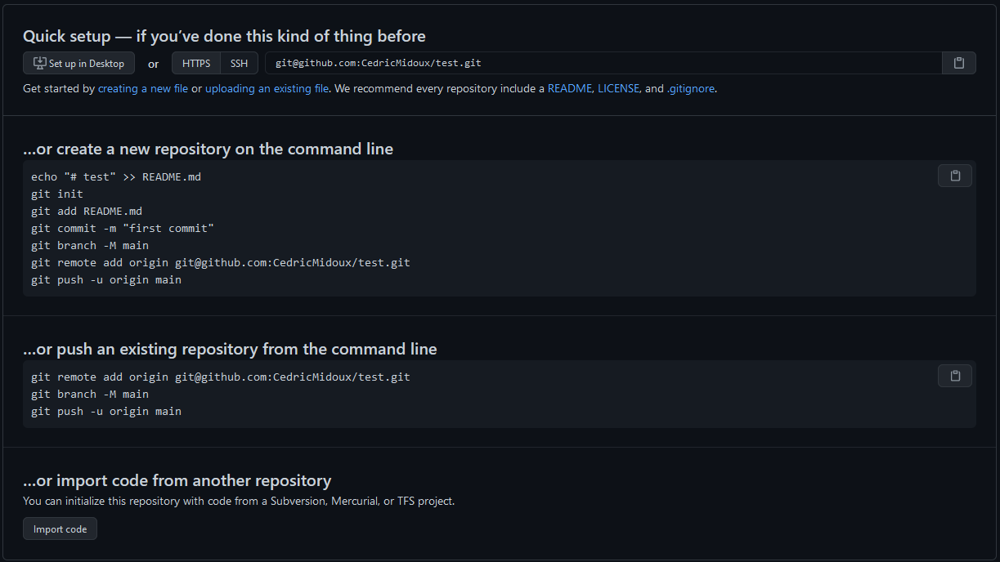

# Créer une clé ssh

```{bash, eval=FALSE}
ssh-keygen -t rsa
ssh-copy-id -i id_rsa.pub <login>@core.cluster.france-bioinformatique.fr
ssh <login>@core.cluster.france-bioinformatique.fr
```

* Pour GitHub, on renseigne les clés publiques via l'interface graphique : https://github.com/settings/keys 

Vous pouvez votre paire de clé depuis plusieurs terminaux mais la clé privée est extrêmement confidentielle et il faut être très vigilent aux fuites et pertes.

# Versionner ses documents avec Git


## Créer un dépôt distant sur Github

```{r, out.width = "50%", echo=FALSE, fig.align='center'}
knitr::include_graphics("images/github-newrepo.png")
```


```{r, out.width = "100%", echo=FALSE}
knitr::include_graphics("images/github-create-repo.png")
```

```{r, out.width = "100%", echo=FALSE}

```

Notez la premiere ligne avec l'adresse pour récupérer le dépôt avec l'option SSH.

Il est aussi possible de faire cela en localement avec `git init` mais dans ce cas il faudra ensuite lié ce dépôt à un remote distant si l'on le souhaite.

```{bash, eval=FALSE}
mkdir testRepo
cd testRepo
git init
# Initialized empty Git repository in /Users/vloux/tmp/testRepo/.git/
```

## Cloner le dépôt depuis GitHub vers l'IFB

```
git clone git@github.com:... # git clone git@github.com:CedricMidoux/test.git
```

Le dépôt est vide et disponible localement.
```{bash, eval=FALSE}
cd test/
ls -la
# total 0
# drwxrwxrwx 1 cmidoux cmidoux 4096 Mar  5 17:21 .
# drwxrwxrwx 1 cmidoux cmidoux 4096 Mar  5 17:21 ..
# drwxrwxrwx 1 cmidoux cmidoux 4096 Mar  5 17:21 .git
```

## Ajouter un document (en local)

On ajoute un premier fichier et on utilise `git status` pour connaitre l'état de notre dépôt.

```{bash, eval=FALSE}
echo 'my first line' > firstFile

git status
# On branch master
#
# No commits yet
#
# Untracked files:
#   (use "git add <file>..." to include in what will be committed)
# 	firstFile
#
# nothing added to commit but untracked files present (use "git add" to track)
```

Le nouveau fichier n'est pas suivi. Il faut l'ajouter avec `git add` puis lorsque toutes les modifications sont suivies, on peut commit avec `git commit`.

```{bash, eval=FALSE}
git add firstFile
git status
# On branch master
# 
# No commits yet
#  
# Changes to be committed:
#   (use "git rm --cached <file>..." to unstage)
# 	new file:   firstFile

git commit -m "Premier commit"
# [master (root-commit) e8b7769] Premier commit
#  1 file changed, 1 insertion(+)
#  create mode 100644 firstFile

git status
# On branch master
# nothing to commit, working tree clean
```

## Modifier un fichier et observer les différences

```{bash, eval=FALSE}
echo 'seconde modif' >> firstFile

git status
# On branch master
# Changes not staged for commit:
#   (use "git add <file>..." to update what will be committed)
#   (use "git restore <file>..." to discard changes in working directory)
# 	modified:   firstFile
#
#no changes added to commit (use "git add" and/or "git commit -a")

git diff
# diff --git a/firstFile b/firstFile
# index b1a9f66..9cc14c7 100644
# --- a/firstFile
# +++ b/firstFile
# @@ -1 +1,2 @@
#  my first line
# +seconde modif

git add firstFile
git commit -m "ajout de la deuxième ligne"
# [master ddcd769] ajout de la deuxième ligne
#  1 file changed, 1 insertion(+)
```

## Pousser les modifications locales sur le dépôt distant

La commande `git push` pousse les modifications de la branche `master` (la branche par défaut locale) sur la branche `origin` (le nom de la branche distante).

```{bash, eval=FALSE}
git push origin master #`git push` est suffisant par défaut
# Enumerating objects: 6, done.
# Counting objects: 100% (6/6), done.
# Delta compression using up to 4 threads
# Compressing objects: 100% (2/2), done.
# Writing objects: 100% (6/6), 487 bytes | 10.00 KiB/s, done.
# Total 6 (delta 0), reused 0 (delta 0)
# To github.com:CedricMidoux/test.git
#  * [new branch]      master -> master
```

On peut lister les différents dépôts distants avec 

```{bash, eval=FALSE}
git remote -v
# origin	git@github.com:CedricMidoux/test.git (fetch)
# origin	git@github.com:CedricMidoux/test.git (push)
```

## Verification sur Github des infos

- Connectez vous sur l'interface de Github :
  - Trouvez votre dépôt
  - Vérifiez que vous trouvez bien le fichier que vous avez modifié, les commits

## Modification du dépôt par l'interface

- Ajouter un `README.md` (avec markdown)
- Le commiter depuis l'interface
- L'éditer
- Commiter la modification

##  Récupérer sur le repo local des infos de la branche distante

```{bash, eval=FALSE}
git fetch
# remote: Enumerating objects: 10, done.
# remote: Counting objects: 100% (10/10), done.
# remote: Compressing objects: 100% (8/8), done.
# remote: Total 9 (delta 0), reused 0 (delta 0), pack-reused 0
# Unpacking objects: 100% (9/9), 2.10 KiB | 7.00 KiB/s, done.
# From github.com:CedricMidoux/test
#    110b5a5..4606251  master     -> origin/master

git merge
# Updating 110b5a5..4606251
# Fast-forward
#  README.md | 3 +++
#  1 file changed, 3 insertions(+)
#  create mode 100644 README.md

cat README.md
# # test
# 
# Ceci est le `README`. On peut facilement l'éditer en ligne avec du *Markdown* et commiter chaque changement ...
```

équivalent à :
 
```{bash, eval=FALSE}
git pull # fetch¨+ merge
```

## Le journal des modifications

On peut lister les commit avec `git log`.

```{bash, eval=FALSE}
git log
# commit 4606251a3f1a63874803c1a2397072b7ac60ebf1 (HEAD -> master, origin/master)
# Author: CedricMidoux <34483895+CedricMidoux@users.noreply.github.com>
# Date:   Mon Mar 8 11:30:27 2021 +0100
# 
#     Update README.md
# 
# ...
```
Pour chaque commit on a un identifiant (SHA), l'auteur, la date et le commentaire (d'où l'interet de correctement nommer ses commits)

```{r, out.width = "50%", echo=FALSE, fig.align='center'}
knitr::include_graphics("https://imgs.xkcd.com/comics/git_commit.png")
```

On peut comparer deux commits différents (en précisant ou non le fichier a comparer). Si on précise qu'un commit, par défaut on compare à `HEAD`.

```{bash, eval=FALSE}
git diff [CommitNumber] [CommitNumber] [File]

git diff 26bce3 # = git diff 26bce3 HEAD
# diff --git a/README.md b/README.md
# index 3bfeb78..4e55303 100644
# --- a/README.md
# +++ b/README.md
# @@ -1,3 +1,3 @@
#  # test
#  
# -Ceci est le README. On peut facilement l'éditer en ligne
# +Ceci est le `README`. On peut facilement l'éditer en ligne avec du *Markdown* et commiter chaque changement ...

git diff 110b5a 1fcc15 firstFile
# diff --git a/firstFile b/firstFile
# index 9cc14c7..b1a9f66 100644
# --- a/firstFile
# +++ b/firstFile
# @@ -1,2 +1 @@
#  my first line
# -seconde modif
```

## Nommer des versions (tags)

```{bash, eval=FALSE}
git tag version1 -m "Initial version"
git log 
# commit 4606251a3f1a63874803c1a2397072b7ac60ebf1 (HEAD -> master, tag: version1, origin/master)

git push --tags
# Enumerating objects: 1, done.
# Counting objects: 100% (1/1), done.
# Writing objects: 100% (1/1), 168 bytes | 3.00 KiB/s, done.
# Total 1 (delta 0), reused 0 (delta 0)
# To github.com:CedricMidoux/test.git
#  * [new tag]         version1 -> version1
```

Sur l'interface en ligne de GitHub, on retrouve les tags.

## Naviguer entre les commits

On peut se détacher de la branche `master` pour revenir à un état antérieur avec la commande `git checkout [commitNumber]`

```{bash, eval=FALSE}
git checkout 110b5a
# Note: switching to '110b5a'.
# 
# You are in 'detached HEAD' state. You can look around, make experimental
# changes and commit them, and you can discard any commits you make in this
# state without impacting any branches by switching back to a branch.
# 
# If you want to create a new branch to retain commits you create, you may
# do so (now or later) by using -c with the switch command. Example:
# 
#   git switch -c <new-branch-name>
# 
# Or undo this operation with:
# 
#   git switch -
# 
# Turn off this advice by setting config variable advice.detachedHead to false
# 
# HEAD is now at 110b5a5 ajout de la deuxième ligne
```

On peut savoir sur quelles branche l'on est avec `git branch`

```{bash, eval=FALSE}
git branch
# * (HEAD detached at 110b5a5)
#   master
```

**Attention**, il faut revenir sur la branche `master` avant de faire des modification. Sinon vous aller créer une nouvelle branche, parallèle à la branche `master`.

```{bash, eval=FALSE}
git checkout master
# Previous HEAD position was 110b5a5 ajout de la deuxième ligne
# Switched to branch 'master'
# Your branch is up to date with 'origin/master'.
git branch
# * master
```

# Documents Computationel  : Rédaction d'un notebook avec RStudio

1. Connectez vous au RStudio de l'IFB (https://rstudio.cluster.france-bioinformatique.fr/).
2. Clonez votre projet :
    - New Project (en haut à droite)
    - Version Control
    - Git
    - Repository URL (clone with SSH : `git@github.com: ...`)
3. Explorez le dépôt depuis ce 3e device remote 
4. Créez un document R Markdown :
    - File 
    - New file
    - R Markdown

**Dans ce document on a** :

- Une entête générale
- Du texte, mis en forme avec markdown
- Du code R dans des chunks
- Des résultats et outputs 

Grâce à l'onglet git de Rstudio, vous pouvez suivre l'état des fichiers, commit, diff, push/pull, ...

Chaque chunk peut être exécuté individuellement grâce à la flèche verte.  
Les options associées à chaque chunks sont disponible avec la roue crantée.

5. Modifier le document (en plusieurs commit)
    - ajoutez un chunk `knitr::kable(head(iris))` pour visualiser un table
    - ajoutez un chunk `plot(cars)` pour un plot
    - ajoutez des commentaires
    - puis commitez les modifications.
6. Lorsque vous êtes satisfait de votre raport, générez la version HTML en cliquant sur Knit. Commitez, pushez, ...
7. Visualisez les modifications côté GitHub
8. Pour rentre une page HTML visualisable avec *GitHub Pages*
    - Dans les options du repo, dans le chapitre "GitHub Pages", activer la source correspondant à la branch `main` (ou master suivant votre configuration)
    - la page est disponible à l'adresse [https://[user].github.io/[repo]/[page].html](https://cedricmidoux.github.io/cookies/notebook.html)

**Votre rapport est disponible, versionné et partageable !**

Suivant l'interlocuteur, partagez le `.Rmd` ou le `.html`

---

# References
