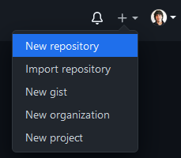
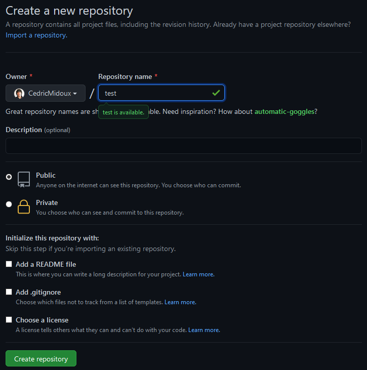

# Créer une clé ssh

```{bash, eval=FALSE}
ssh-keygen -t rsa
ssh-copy-id -i id_rsa.pub login@core.cluster.france-bioinformatique.fr
ssh login@core.cluster.france-bioinformatique.fr
```

# Git

```{bash, eval=FALSE}
mkdir testRepo
cd testRepo
git init
```

```{bash, eval=FALSE}
vloux@jj-1404-port196 ~/tmp> mkdir testRepo
vloux@jj-1404-port196 ~/tmp> cd testRepo
vloux@jj-1404-port196 ~/tmp> git init
Initialized empty Git repository in /Users/vloux/tmp/testRepo/.git/
```

```{bash, eval=FALSE}
echo 'my first line' > firstFile

git status
```


```{bash, eval=FALSE}
vloux@jj-1404-port196 ~/t/testRepo> echo 'my first line' > firstFile

vloux@jj-1404-port196 ~/t/testRepo>   git status
On branch master

No commits yet

Untracked files:
  (use "git add <file>..." to include in what will be committed)
	firstFile

nothing added to commit but untracked files present (use "git add" to track)
```

```{bash, eval=FALSE}
git add firstFile
git commit firstFile -m "Premier commit"

git status
```


```{bash, eval=FALSE}
vloux@jj-1404-port196 ~/t/testRepo> git add firstFile
vloux@jj-1404-port196 ~/t/testRepo> git commit firstFile -m "Premier commit"
[master (root-commit) 53e1cbc] Premier commit
 1 file changed, 1 insertion(+)
 create mode 100644 firstFile
vloux@jj-1404-port196 ~/t/testRepo> git status
On branch master
nothing to commit, working tree clean
```

```{bash, eval=FALSE}
echo 'seconde modif' >> firstFile

git status
git diff

git commit -m "ajout de la deuxième ligne" firstFile

```

```{bash, eval=FALSE}
vloux@jj-1404-port196 ~/t/testRepo> git status
On branch master
Changes not staged for commit:
  (use "git add <file>..." to update what will be committed)
  (use "git restore <file>..." to discard changes in working directory)
	modified:   firstFile
vloux@jj-1404-port196 ~/t/testRepo> git diff
diff --git a/firstFile b/firstFile
index b1a9f66..d491802 100644
--- a/firstFile
+++ b/firstFile
@@ -1 +1,2 @@
 my first line
+second modif
vloux@jj-1404-port196 ~/t/testRepo> git commit -m "ajout de la deuxième ligne" firstFile
On branch master
[master b3a2b4c] ajout de la deuxième ligne
 1 file changed, 1 insertion(+)
```


- Créer un dépôt distant sur Github (1)



## Initialisation du dépôt distant (Github)


- Créer le dépôt distant sur Github
- Noter l'adresse du dépôt dans l'écran suivant.

```{r, out.width = "100%", echo=FALSE, fig.align="right"}

```


```{r, out.width = "100%", echo=FALSE, fig.align="right"}
knitr::include_graphics("images/github-createrepo-2.png")
```


## Lier le dépôt local et distant

- La commande `git remote` permet de lier notre dépôt à un dépôt distant, ici `test.git`
- Par convention, on appelle ce dépôt `origin`


```{bash, eval=FALSE}
git remote add origin git@github.com:vloux/test.git
git remote -v

```

```{bash, eval=FALSE}
vloux@jj-1404-port196 ~/t/testRepo> git remote add origin git@github.com:vloux/test.git
vloux@jj-1404-port196 ~/t/testRepo> git remote -v
origin	git@github.com:vloux/test.git (fetch)
origin	git@github.com:vloux/test.git (push)

```


## Pousser les modifications locales sur le dépôt distant

LA commande `push`pousse les modifications de la branche `master` (la branche par défaut locale) sur la branche `origin`(le nom de la branche distante). Le paramètre `-u` permet de créer la branche de reférence distante et de lier les branches disatntes et locales (et ainsi de se passer des arguments `origin` `master` par la suite)

```{bash, eval=FALSE}
git push origin master -u 
```

```{bash, eval=FALSE}
vloux@jj-1404-port196 ~/t/testRepo> git push  origin master -u
Enumerating objects: 6, done.
Counting objects: 100% (6/6), done.
Delta compression using up to 8 threads
Compressing objects: 100% (2/2), done.
Writing objects: 100% (6/6), 489 bytes | 489.00 KiB/s, done.
Total 6 (delta 0), reused 0 (delta 0)
To github.com:vloux/test.git
 * [new branch]      master -> master
Branch 'master' set up to track remote branch 'master' from 'origin'
```

## Verification sur Github des infos

- Connectez vous sur l'interface de Github :
  - trouvez votre dépôt
  - verifiez que vous trouvez bien le fichier que vous avez modifié, les commits


## Modification du dépôt par l'interface

- ajouter un `README.md` (avec markdown)
- le commiter depuis l'interface
- l'éditer

- commiter la modification

##  Récupérer sur le repo local des infos de la branche distante

```{bash, eval=FALSE}
git fetch
git merge
```
équivalent à :
 
```{bash, eval=FALSE}
git pull
```


```{bash, eval=FALSE}
vloux@jj-1404-port196 ~/t/testRepo> git fetch
remote: Enumerating objects: 7, done.
remote: Counting objects: 100% (7/7), done.
remote: Compressing objects: 100% (4/4), done.
remote: Total 6 (delta 0), reused 0 (delta 0), pack-reused 0
Unpacking objects: 100% (6/6), done.
From github.com:vloux/test
   b3a2b4c..c61dab3  master     -> origin/master
vloux@jj-1404-port196 ~/t/testRepo> git merge
Updating b3a2b4c..c61dab3
Fast-forward
 README.md | 1 +
 1 file changed, 1 insertion(+)
 create mode 100644 README.md
```


Nommer des versions (tags)

```{bash, eval=FALSE}
git tag version1 -m "Initial version"
 
git push  --tags

```

```{bash, eval=FALSE}
vloux@jj-1404-port196 ~/t/testRepo> git tag version1 -m "Initial version"
version1
vloux@jj-1404-port196 ~/t/testRepo>  git push  --tags
Enumerating objects: 1, done.
Counting objects: 100% (1/1), done.
Writing objects: 100% (1/1), 171 bytes | 171.00 KiB/s, done.
Total 1 (delta 0), reused 0 (delta 0)
To github.com:vloux/tesRepository.git
 * [new tag]         version1 -> version1
```


Comparer à une version précédente

```{bash, eval=FALSE}
git log

git diff [CommitNumber] aNewFile

```


```{bash, eval=FALSE}
vloux@jj-1404-port196 ~/t/testRepo> git diff 53e1cbcc5cab26f6c1550acd159ca30ad2acfeec firstFile
diff --git a/firstFile b/firstFile
index b1a9f66..d491802 100644
--- a/firstFile
+++ b/firstFile
@@ -1 +1,2 @@
 my first line
+second modif
```


## Cloner un dépôt existant

- Dans le cas d'un dépôt distant existant, on peut directement le cloner en local. Il est lié au dépot distant et les modifications peuvenat ainis être récupérées ( `pull`) ou poussées ( `push`) sans avoir besoin de d'abord configurer les liens avec le dépôt distant.

```{bash, eval=FALSE}
git clone git@github.com:vloux/test.git

git remote -v


```


# References
