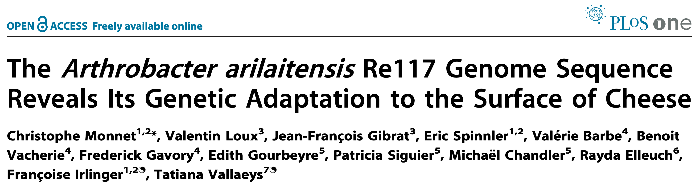
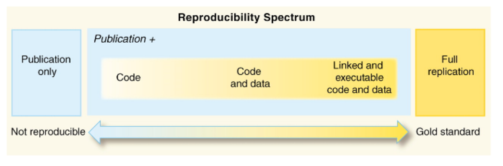
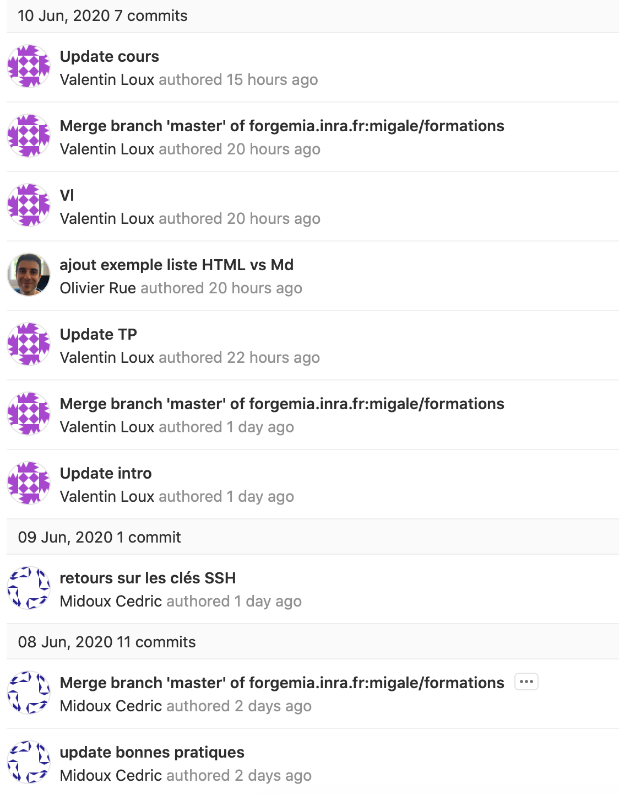
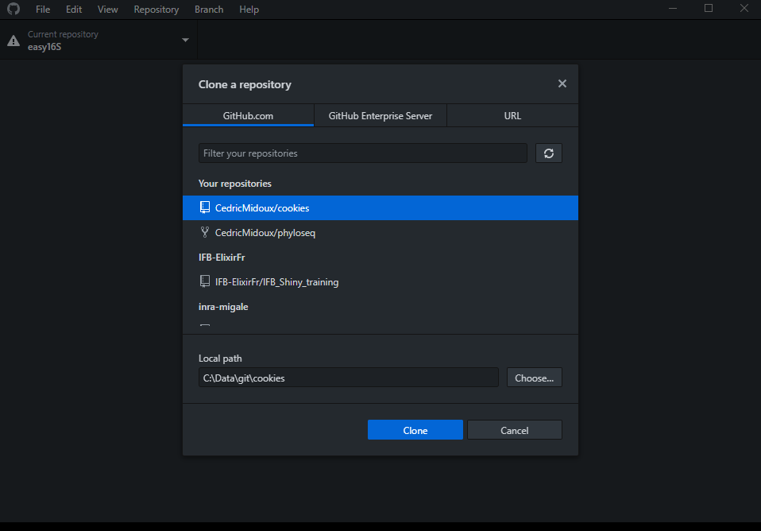
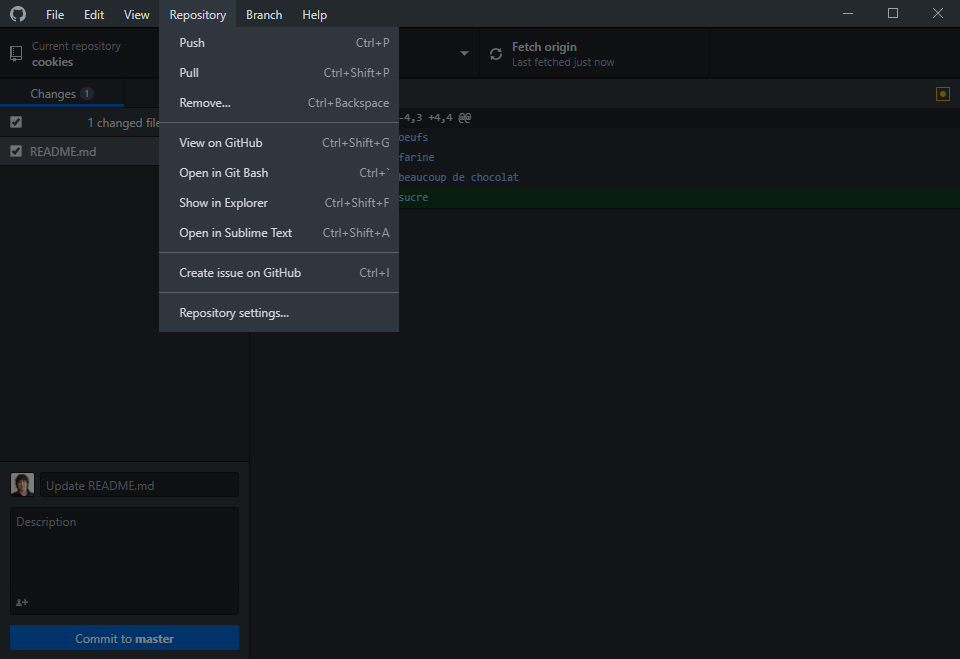
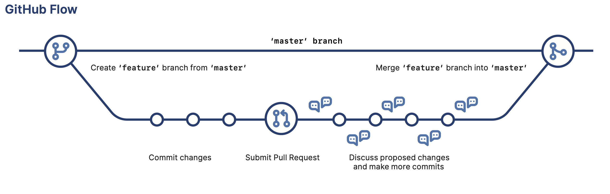

class: hide-logo

```{r setup, include=FALSE}
options(htmltools.dir.version = FALSE)
library(RefManageR)
# install.packages("remotes")
#remotes::install_github("mitchelloharawild/icons")
library(icons)
#download_fontawesome()
BibOptions(check.entries = FALSE, bib.style = "authoryear", style = "markdown",
           dashed = TRUE)
file.name <- "biblio_slides.bib"
bib <- ReadBib(file.name, .Encoding = "UTF-8")
```


# Programme de l'après-midi
<!--  14-17h -->

- Intro : Quelques généralités sur la reproductibilité et la démarche science ouverte <!-- 25 mn) -->

- Partie 1 : Organiser son espace de travail  <!-- 5 mn -->

- Partie 2 : Versionner ses documents <!-- 45 mn -->

  - TP

<!-- 15h45 Pause -->

- Partie 3 : Des langages à faible balisage pour faciliter la traçabilité et la prise de note <!-- 30 mn -->

- Partie 4 : Utilisation de documents computationels -- Notebook <!-- 45 mn -->
  - TP

- Conclusion &  aller + loin <!-- 15 mn -->

---
# Tout le monde a déjà eu cette expérience

--
.pull-left[
```{r, out.width = "100%", echo=FALSE, fig.align="center", fig.cap= "Un article interessant"}

```
]

--
.pull-right[
```{r, out.width = "100%", echo=FALSE, fig.align="center", fig.cap= "Un matériel et méthodes décevant"}
knitr::include_graphics("images/monnet-loux-plosone-mat-met.png")
```
]

--


---
# Crise de la reproductibilité

- Problème **général**,  "Reproducibility Crisis"
  - Remis en avant par les science sociales, notamment la psychologie
  - Étendu à l'ensemble des disciplines scientifiques

Mais un problème qui n'est **pas nouveau** :
  - Expériences de la pompe à vide au XVIIe siècle (von Guericke et Boyle) 

```{r, out.width = "40%", echo=FALSE, fig.align="center",fig.cap="Experiences des hemisphères de Magdebourg"}
knitr::include_graphics("images/Magdeburger-Halbkugeln.jpg")
```

???
Au XVIIe, expérience de la pompe à vide par Otto van Guericke étaient basées sur des démonstrations spectaculaires, dans les cours d'Europe qui lui assuraient notoriété. L'expérience des hemisphères de Magdebourg qui consistait à essayer de faire séparer des hémisphères de cuivre dans lesquels il avait fait le vide, par des attelages de chevaux était très appréciée. Cela reposait sur un outillage et un savoir faire secret. Impossible à reproduire
Plus tard, Boyle, sur le même sujet, consignait tout par écrit et avait recours à des témoins de bonne réputation (des gentlemen, à la base de la Royal Society) pour certifier ses expériences. c'est le début des publication scientifiques.
  
---
# Et en bioinfo ?

Un problème vieux comme la bioinformatique :

- En 2009, moins de la moitié des expériences de transcriptomique parues dans Nature Genetics ont pu être reproduites 
- Sur 50 articles citant BWA en 2011, 31 ne citent ni version, ni paramètres. 26 ne donnent pas accès aux données sous-jacentes
- Selon un sondage mené en 2016 auprès de plus de 1500 biologistes
  - 70% ont déjà éprouvé des difficultés à reproduire une analyse `r Citep(bib, "Baker2016")`

- [Ten Years Reproducibility Challenge](https://github.com/ReScience/ten-years) : êtes vous capables de refaire vos analyses d'il y a 10 ans ? 

---
# Quelles sont les difficultés ?

- Problèmes **d'accès aux données** :
  - le fameux "data available upon request"
  - données brutes disponibles, mais méta-données inexistantes ou insuffisantes
- Problèmes **d'accès aux outils** :
  - outils anciens ou obsolètes
  - difficultés à installer
- Problèmes de **paramètrage de l'analyse**
  - version des outil
  - paramètres des outils
  - enchaînement des outils

- Problème d'accès aux **ressources necessaires**
  - calcul
  - stockage


---
# Réplication ≠ Reproductibilité

- La réplication indépendante d'expériences est à la base de la méthode scientifique

- En complément de **réplication** indépendante ( expérimentation, échantillonnage, analyse, …), la **reproduction** d'analyse est indispensable à l'évaluation et à la compréhension de la démarche employée

- Il existe une ambiguïté en anglais entre réplication (*réplication*) et reproduction (*reproducibility*). Derrière la *reproducibility crisis* on mélange les deux :
  - Impossibilité de répliquer des résultats de façon indépendante (psychologie, médecine, biologie…)
  - Impossibilité de reproduire des analyses à partir des mêmes données de départ

- Chacun peut déjà, par la mise en place de pratiques simples et l'utilisation d'outils conviviaux, améliorer la reproductibilité de ses travaux

Source : `r Citep(bib, "allard")` 
<!-- https://laviedesidees.fr/La-crise-de-la-replicabilite.html -->

---
# En pratique, qu'est ce qu'être reproductible ?


```{r, out.width = "80%", echo=FALSE, fig.align="left",fig.cap="https://github.com/karthik/rstudio2019/blob/master/reproducible-data-analysis.pdf"}
knitr::include_graphics("images/reproducible-data-analysis.png")
```

---
# En pratique, qu'est ce qu'être reproductible (2) ?

  Avoir accès :
  - aux pièces (les **données**)
  - aux outils ( les **logiciels**, )
  - au mode d'emploi : **paramètres**, **workflows d'analyse**
  
  Mais aussi :
  - à la description des pièces, de la façon dont elles ont été produites (**méta-données**)
  - à la documentation technique (**choix techniques explicites**)
  - au savoir faire du monteur (**formations**)
  - Éventuellement à un atelier équipé pour le montage (**ressources informatiques**)

---

# FAIR : un pré-requis à la reproductibilité
.pull-left[
```{r, out.width = "50%", echo=FALSE, fig.align="left", fig.cap= "Findale Accessible Interoperable Reusable "}
knitr::include_graphics("images/fair.png")
```
]
.pull-right[
Principes autour des données au sens large :
- **F**acile à trouver : pour les humains et les ordinateurs :
  - id unique et pérennes
  - métadonnées riches
- **A**ccessibles à ** long terme**
  - entrepôt "pérenne"
  - licence d'utilisation explicite ( FAIR ≠ ouvert)
- **I**nteroperables : faciles à combiner avec d'autres jeux de données
  - formats ouverts et documentés
  - vocabulaire standardisé, ontologies (données et méta-données)
- **R**éutilisables :
  - réutilisables par soi, par d'autres
  - réutilisables par des machines
]

`r Citep(bib, "Wilkinson2016")` 

---

# Le spectre de la reproductibilité

```{r, out.width = "100%", echo=FALSE, fig.align="center", fig.cap= "Spectre de la reproductibilité,"}

```
Source : `r Citep(bib, "piazzi")` 

---
# En pratique, que faire, quels outils utiliser ?

Aller de façon **pragmatique** vers une documentation accrue de ce que l'on fait (comment, pourquoi) et des données que l'on utilise et produit. 

- Rendre accessible ses données à soit, aux partenaires, à tous) :
  - Documenter collectivement ses pratiques de gestion de données (responsabilités, formats, cycle de vie, archivage…) dns un Data Management Plan qui doit être **vivant** et partagé.(Opidor) 
  - Dépôt internationaux (ENA, NCBI) pour les données specialisées
  - DataVerse, Figshare, Zenodo ou autre  pour les autres données
- Définir et fixer les versions des outils utilisés :
  - Conda, Bioconda
  - Singularity, Docker
  - Machine Virtuelle
- Décrire son workflow d'analyse, le rendre portable : 
  - Galaxy
  - Snakemake, Nextflow
- Gérer les versions de ses codes, les publier :
  - git
  - github / gitlab
- Tracer son analyse dans des documents computationnels partageables et réutilisables :
    - Rmd
    - Jupyter Notebooks

---
# Objectifs du TP

Décomplexifier les problème, se décomplexifier sur ses pratiques , désacraliser  la reproductibilité !

Vous fournir des outils, des pistes pour rendre vos projets :
- transparents
- robustes
- réutilisables
- partageables

Bref, *plus* ouverts et reproductibles.


Parties pratiques sur la versionning des documents (Git et GitHub) et les documents  computationnels.

---
class: inverse, center, middle
# Partie 1 : Organiser son espace de travail 

---
# Partie 1 : Organiser son espace de travail 
.pull-left[

Source : `r Citep(bib, "noble")`  

]

.pull-right[
Séparer 
- données
- code
- scripts
- résultats

- Avoir un copie de sauvegarde de ses données
- Mettre le repertoire et les fichiers de données en lecture seule
- Avoir une convention de nommage de ses fichiers
]

---
# Organiser son espace de travail (2)


Source : `r Citep(bib, "Wilson")` 

---
class: inverse, center, middle
# Partie 2 : Versionner ses documents 

---
```{r, out.width="40%", echo=FALSE, fig.align="center", fig.cap= "Piled Higher and Deeper by Jorge Cham. phdcomics"}
knitr::include_graphics("images/phd101212s.gif")
```

---
# Partie 2 : Versionner ses documents 

.pull-left[
- Les documents évoluent, il est nécéssaire de suivre les versions 
  - On trace toutes les modifications faites
  - On garde chaque version des documents du dossier de travail
  - C’est un peu comme copier-coller son dossier de travail … mais en beaucoup plus précis et pratique !
  - `git` est un standard dans la gestion des versions distribuée  
]

.pull-right[

]


Voici un [aide mémoire git](https://github.github.com/training-kit/downloads/fr/github-git-cheat-sheet.pdf)
---
# Vocabulaire
.pull-left[
Quelques mots à connaitre :
- **Repository** / **Dépôt** = Dossier / Projet 
- **Commit** = Enregistrement d’un ensemble de fichier à un instant T (= photo) 
- **Branche** = Ensemble chaîné de commits, par défaut la branche principale s'appelle « main »


- **Git** : logiciel *open-souce*  de gestion de version de document. Il est tout a fait possible d'utiliser git pour versionner ses documents sans GitHub.
- **Github** : site web permettant de centraliser en ligne ses dépôts git et facilitant la collaboration sur les projets.
]

.pull-right[
```{r, out.width = "100%", echo=FALSE, fig.align="right"}
knitr::include_graphics("images/git-github.png")
```
]
---
# Retours sur les clés SSH

* Protocole pour la sécurisation des transferts de données.

* Méthode de chiffrement asymétrique qui fonctionne avec une paire de clé :
  * une clé *publique* qui sert à chiffrer (et que vous pouvez partager à l'extérieur)
  * une clé *privée* qui sert à déchiffrer (et que vous gardez précieusement secrète)

* Permet d'établir un tunnel sécurisé entre deux machines

---
class: center, middle

---
class: center, middle

---
class: center, middle

---
class: center, middle

---
class: center, middle


---
# Retours sur les clés SSH

* Protocole pour la sécurisation des transferts de données.

* Méthode de chiffrement asymétrique qui fonctionne avec une paire de clé :
  * une clé *publique* qui sert à chiffrer (et que vous pouvez partager à l'extérieur)
  * une clé *privée* qui sert à déchiffrer (et que vous gardez précieusement secrète : `chmod 400 ~/.ssh/id_rsa`)

* Permet d'établir un tunnel sécurisé entre deux machines

---
# Comment générer une clef, en pratique :
* Sous Linux, on utilise `ssh-keygen -t rsa` pour générer la paire de clé
* Puis `ssh-copy-id -i id_rsa.pub <login>@<server>` si on veut envoyer la clé publique sur un serveur distant
* Maintenant on peut se connecter de manière sécurisée via `ssh <login>@<server>` sans renseigner de clé

* Pour **GitHub**, **Rstudio** on renseigne les clés publiques via l'interface graphique

---
class: center, middle

# TP : générer sa clef ssh  
---

---
class: center, middle

# TP : Utilisation de Git  
---

# Git : En résumé 

- `git clone` : cloner un dépot distant
- `git init` : initialiser le versionning sur un dépot local
- `git commit` : enregister l'état d'un dépôt
- `git status` : afficher l'état des documents du dépôt
- `git diff` : comparer l'état actuel au dernier commit, ou deux commits entre eux ou deux branches 
- `git pull` : récupérer les commits distants
- `git push` : envoyer les commits locaux

et bien d'autres encore (`blame`, `revert`,…)

[CheatSheet](https://github.github.com/training-kit/downloads/github-git-cheat-sheet.pdf)

---
# Pour apprendre progressivement et/ou se simplifier la vie

Utiliser une interface conviviale :
- Github Desktop (Windows et macOS)
- Les intégration aux différents IDE (RStudio and co)

.center[
.pull-left[]
.pull-right[]
]

---
```{r, out.width = "80%", echo=FALSE, fig.align="center", fig.cap= "Cloner un dépot"}

```
---
```{r, out.width = "80%", echo=FALSE, fig.align="center", fig.cap= "Suivre les changements"}
knitr::include_graphics("images/github_desktop_2.png")
```
---
```{r, out.width = "80%", echo=FALSE, fig.align="center", fig.cap= "Parcourir l'historique des modifications"}
knitr::include_graphics("images/github_desktop_3.png")
```
---
```{r, out.width = "80%", echo=FALSE, fig.align="center", fig.cap= "Intéragir avec le Repository"}

```

---
class: center, middle


---
class: inverse, center, middle
# Partie 3 : Des langages à faible balisage pour faciliter la traçabilité et la prise de note

---
# Partie 3 : Des langages à faible balisage pour faciliter la traçabilité et la prise de note

*Comment mettre en forme et structurer simplement un document texte ?*  

--
&rarr; avec un balisage faible tel que *Markdown* 

--

.pull-left[
- Permet :
  - Organiser les titres de sections
  - Italique / gras / souligné
  - Générer des listes
  - Ajouter des tableaux
  - Insertion d'image et de blocs de code

- Texte codé en UTF-8 (assure une pérennité, lisibilité et portabilité) facilement versionnable.
- Les langages de balisage permettent de mettre en forme convenablement le fichier pour un meilleur confort de lecture.

]

--

.pull-right[
_Exemple illustrant la simplification du balisage :_

- HTML

```{bash, eval=FALSE}
  <ul>
    <li>item1</li>
    <li>item2</li>
  </ul>
```

- Markdown

```{bash, eval=FALSE}
  - item1
  - item2
```
]

---
# Partie 3 : Markdown - exemples de mise en forme 

````
# Titre H1
## Sous-titre H2
### Sous-titre H3

*italique*, **gras** et `code`

> Citations

```
bloc de code
```

* liste
  * item
  * item
  
[lien](https://fr.wikipedia.org)
 
      #lien vers une image en ligne ou dans l'espace de travail
````

Gardez ce [mémo](https://guides.github.com/pdfs/markdown-cheatsheet-online.pdf) à porté de main !

---
class: inverse, center, middle
# Partie 4 : Documents computationels - Notebook

---
# Partie 4 : Documents computationels - Notebook

- Il faut se donner les moyens pour qu’autrui puisse inspecter nos analyses
- Expliciter pour augmenter les chances de trouver les erreurs et de les éliminer
  - Inspecter pour justifier et comprendre
  - Refaire pour vérifier, corriger et réutiliser

.center[] 

---
# Partie 4 : Documents computationels - Notebook

- Regrouper dans *un unique document*: 
  - Les informations, le code, calculs et les résultats 
  - Pour assurer leur cohérence et améliorer la traçabilité. 
  - Exportable (ex : html) pour une meilleure portabilité et lisibilité.

```{r, out.width = "50%", echo=FALSE, fig.align="center"}
knitr::include_graphics("https://www.researchgate.net/profile/Dario_Righelli/publication/306538473/figure/fig2/AS:391153263366144@1470269613039/This-figure-explains-the-basic-idea-of-Reproducible-Research-The-raw-data-needs-to-be_W640.jpg")
```

`r Citep(bib, "russo")`

Encore un joli [mémo](https://www.rstudio.org/links/r_markdown_cheat_sheet) pour R markdown. 

Si vous travaillez principalement avec Python, il est possible de faire des notebook avec Jupyter.

---
class: center, middle

# TP : Documents computationels  
---

# Documents computationels : En résumé 

**Dans un unique document on a** :
- Une entête générale
- Du texte, mis en forme avec markdown
- Du code R ou Python (ou autre) dans des chunks
- Des résultats, plots et outputs 

* Ce document est versionné
* Il est dans un format texte dont la lisibilité est assurée au cours du temps
* On peut l'exporter en HTML et le rendre accessible via les GitHub Pages.

** &rarr; Expliciter pour augmenter les chances de trouver les erreurs et de les éliminer **
  - Inspecter pour justifier et comprendre
  - Refaire pour vérifier, corriger et réutiliser

---
# Conclusion : 

La reproductibilité, comme la "FAIRisation" sont des processus.

Des bonnes pratiques appuyées par des outils qui les facilitent

- Organiser ses analyses
- Décrire correctement ses données et ses processus d'analyse (PGD, FAIR)
- Tracer ses analyses à l'aide de documents computationels (Rmd, Jupyter Notebooks, …) :
  - Transparents 
  - Accessibles
  - Partageables
- Versionner ses documents computationnels (GitHub, GitLab, …)
  - Traçabilité
  - Accessibilité

---
# Aller plus loin - Travailler en commun avec Git et Github :

.center[] 


- Branche : version parallèle à la version principale
- Pull Request : demande de fusion des modifications d'une brache vers la branche principale

[Un exemple de PR](https://github.com/galaxyproject/training-material/pull/1354) 

---
# Pour aller + loin - Fixer et partager son environnement :

.pull-left[
- Conda et  Bioconda 
  - gestion des dépendances, versions
  - Possibilité de créer un environnement par analyse
  - Exporter son environnement dans un fichier `env.yml` et le versionner
  - `conda env export > environment.yml`
  
- Containers,  machines virtuelles
  - Docker, Singularity, VM virtualbox
  - Pour les outils non "conda-isables", les environnements complexes
  - Les images Singularity sont déployables sur les infrastructures type IFB et s'éxecutent "presque" comme un executable
]

.pull-right[
.center[]
.center[]


]

---
# Pour aller plus loin - Fixer et partager son environnement (2) 
.center[]

`r Citep(bib, "Bjorn2018")` 

---
# Pour aller + loin - Gestionnaires de workflows

SnakeMake, NextFlow pour :
- Définir de façon "simple" et modulaire des workflows d'analyse :
  - Parallelisables : les étapes indépendantes peuvent être jouées en parallèle.
  - Qui assurent la reprise sur erreur : si on refait une analyse, change un paramètre, seul ce qui doit être rejoué est relancé.
  - Portables : un même script peut être joué en local, sur des  clusters différents en changeant le fichier de configuration.
  - Partageables : un fichier texte versionné
  - Peut gérer pour vous le versionning et l'installation des outils avec Conda


---
# Pour aller + loin - exemple de Snakefile

**Bash**

```
 for sample in `ls *.fastq.gz` do
  fastqc ${sample}
done
```

--

**Snakefile**

```
SAMPLES, = glob_wildcards("./{smp}.fastq.gz")

rule final: 
  input:expand("fastqc/{smp}/{smp}_fastqc.zip",smp=SAMPLES)
rule fastqc:
  input: "{smp}.fastq.gz"
  output: "fastqc/{smp}/{smp}_fastqc.zip"
  message: """Quality check"""
  shell: """fastqc {input} --outdir fastqc/{wildcards.smp}"""
```

---
# Pour aller + loin - FAIRifier ses données
Dépots dans les dépôts publics :
- Dans les dépôts thématiques internationaux (européens !)  
    - données brutes 
    - données analysées
    - /!\ méta-données
- dans les dépots généralistes (dataverse , figshare, …)
  - fichiers tabulés; "autres" données. ce qu'on mettrait en suypplementary material.
  - (éventuels) leins vers les fichiers de données

- Publier un data-paper ?


---
# Pour aller + loin :
.pull-left[
- jusqu'où aller dans la reproductibilité ?
  - Mat et Met électroniques :
    - Galaxy Pages
    - Gigascience, GigaDB : 
      - "GigaScience aims to revolutionize publishing by promoting reproducibility of analyses and data dissemination, organization, understanding, and use. "

]
.pull-right[
```{r, out.width = "80%", echo=FALSE, fig.align="center", fig.cap= "Live Mat et Met https://usegalaxy.org/u/aun1/p/windshield-splatter"}
knitr::include_graphics("images/galaxy-pages.png")
```

Au final, toujours se poser la question du rapport coût / bénéfice.
]


---

# Ressources

- [FUN MOOC Recherche Reproductible](https://www.fun-mooc.fr/courses/course-v1:inria+41016+self-paced/about)
- [FAIR Bioinfo](https://github.com/thomasdenecker/FAIR_Bioinfo)
- [Cours Git et Github](https://guides.github.com)
- [Github pages](https://pages.github.com)
- [Rmd the definitive Guide](https://bookdown.org/yihui/rmarkdown/)
- [Snakemake](https://snakemake.readthedocs.io/en/stable/)
- [NextFlow](https://www.nextflow.io) et [nf-core](https://nf-co.re)
- 

- Les mémo présentés dans ce cours :
  - [markdown](https://guides.github.com/pdfs/markdown-cheatsheet-online.pdf)
  - [git](https://github.github.com/training-kit/downloads/fr/github-git-cheat-sheet.pdf)
  - [R markdown](https://www.rstudio.org/links/r_markdown_cheat_sheet)

---

# References
```{r, results='asis', echo=FALSE}
PrintBibliography(bib)
```
