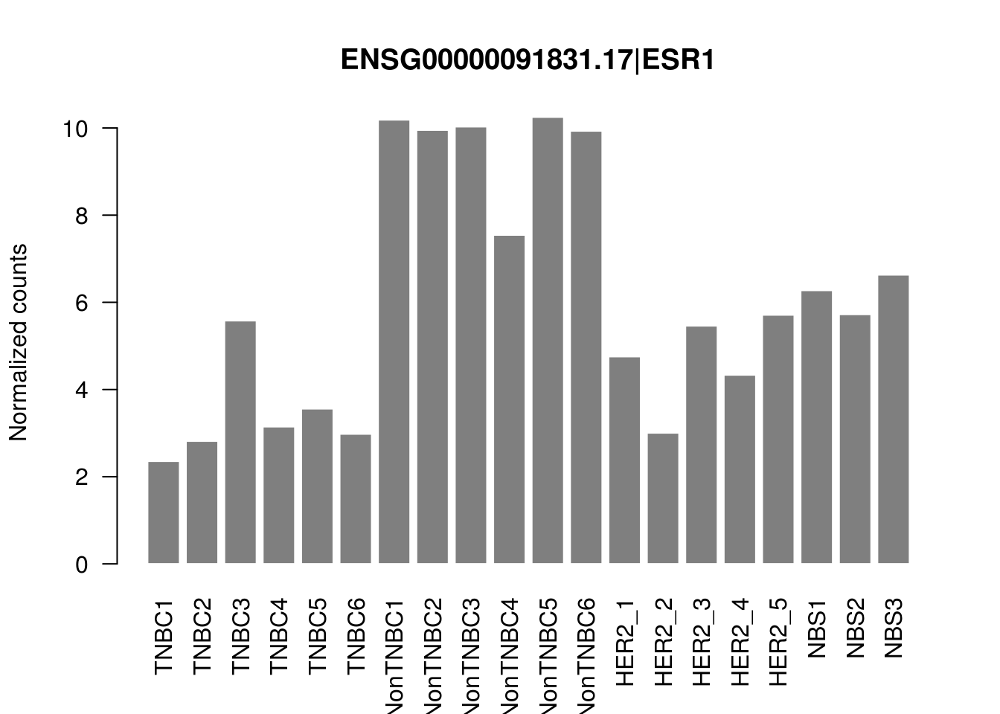
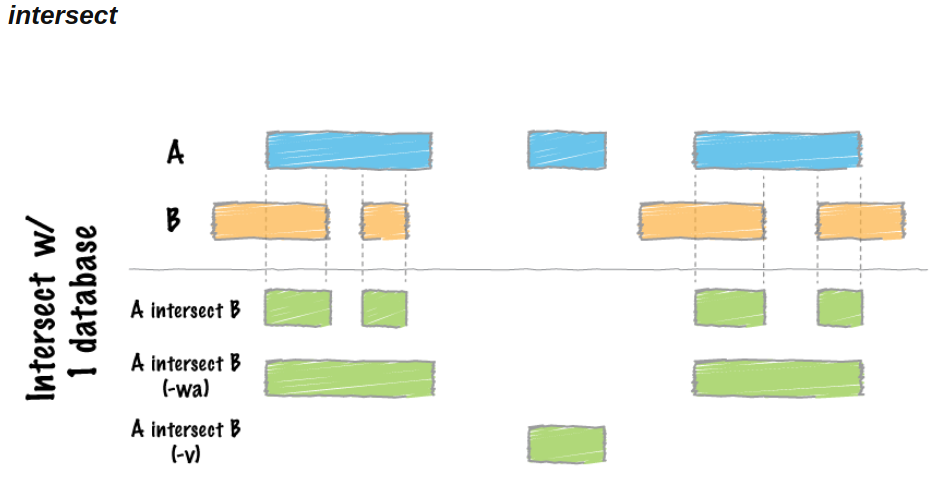

# Introduction {-}

Vous travaillerez dans ce tutoriel sur les données du cours du Module 5 - Séance 2 (RNAseq), issues de la [publication de Horvath et al](https://pubmed.ncbi.nlm.nih.gov/22355776/).

Des données RNAseq ont été générées, entre autres, à partir d'échantillons de patientes saines (NonTNBC) et de patientes atteintes du cancer du sein (TNBC).

Pour rappel, voici un design de l'étude :

```{r, out.width = "70%", echo=FALSE, fig.align="center"}
knitr::include_graphics("images/desin_publi.jpg")
```

L'analyse différentielle a ressorti le gène `ENSG00000091831` comme étant le plus différentiellement exprimé.


```{r, out.width = "70%", echo=FALSE, fig.align="center"}

```

---

Pour ce TP, vous ne travaillerez que sur 2 échantillons :

* 1 échantillon TNBC (TNBC1) : SRR1027171 (GSM1261016)
* 1 échantillon NonTNBC (NonTNBC1) : SRR1027177 (GSM1261022)

Pour chaque échantillon, vous aurez accès aux **alignements**, aux **transcrits**, ainsi qu'aux **variants**.

Vous aurez également à disposition des données publiques du génome humain :

* le génome humain: `data/Homo_sapiens.GRCh38.dna.toplevel.fa`
* son annotation: `data/Homo_sapiens.GRCh38.100.gff3`
* les variants humains connus: `data/common_all_20180418.vcf`

Vous allez croiser ces données hétérogènes en utilisant <strong class="tool">bedtools</strong> @bedtools pour répondre à ces différentes questions :

- Quelle est la séquence génomique du gène ENSG00000091831 ? (`getfasta`)
- Quel est son contenu en GC ? (`nuc`)
- Combien de variants connus sont présents dans ce gène ?
- Combien de SNVs (single nucleotide variants) sont communs et différents entre TNBC1 et NonTNBC1 sur le gène ?
- Existe-t-il des variants connus dans la région promotrice de ce gène ? (`flank`)
- Quels sont les transcrits complets spécifiques à l'échantillon NonTNBC1 ? (`subtract`)
- Quel est le micro-ARN (miARN) le plus proche de ce gène ? À quelle distance ? (`closest`)
- Quelle est la différence de couverture et de profondeur du gène ENSG00000091831 pour les échantillons TNBC1 et NonTNBC1 ? (`genomecov` / `coverage` / `intersect bam` / `bam2bed`)

# Préparation de l'espace de travail et récupération des données publiques

Les données dont vous aurez besoin sont dans le répertoire <code>/shared/projects/dubii2020/data/module5/seance4/data</code>. Un lien symbolique du répertoire permettra d'y avoir accès sans dupliquer les données.

    mkdir ~/M5-S4/
    cd ~/M5-S4
    ln -s /shared/projects/dubii2020/data/module5/seance4/data .

Pour information, voici les commandes utilisées pour récupérer les données.

```{bash, eval=FALSE}
## Les fichiers FASTQ de la publication
module load sra-tools
srun --cpus-per-task 8 fasterq-dump -S -p SRR1027171 --outdir . --threads 8
srun --cpus-per-task 8 fasterq-dump -S -p SRR1027177 --outdir . --threads 8
## Le génome humain au format FASTA et son index
ln -s /shared/data/bank/homo_sapiens/GRCh38/fasta/Homo_sapiens.GRCh38.dna.toplevel.fa .
ln -s /shared/data/bank/homo_sapiens/GRCh38/fasta/Homo_sapiens.GRCh38.dna.toplevel.fa.fai .
## Taille des chromosomes
cut -f1,2 /shared/bank/homo_sapiens/GRCh38/fasta/Homo_sapiens.GRCh38.dna.primary_assembly.fa.fai > my.genome

## L'annotation du génome humain au format GFF3
wget ftp://ftp.ensembl.org/pub/release-100/gff3/homo_sapiens/Homo_sapiens.GRCh38.100.gff3.gz
gzip -d Homo_sapiens.GRCh38.100.gff3.gz

## Les variants issus des deux échantillons de la publication
wget https://ftp.ncbi.nlm.nih.gov/geo/samples/GSM1261nnn/GSM1261016/suppl/GSM1261016%5FIP2%2D50%5Fvar%2Eflt%2Evcf%2Egz
wget https://ftp.ncbi.nlm.nih.gov/geo/samples/GSM1261nnn/GSM1261022/suppl/GSM1261022%5FIP2%2D42%5Fvar%2Eflt%2Evcf%2Egz
gzip -d GSM1261016_IP2-50_var.flt.vcf.gz
gzip -d GSM1261022_IP2-42_var.flt.vcf.gz
mv GSM1261022_IP2-42_var.flt.vcf NonTNBC1.vcf
mv GSM1261016_IP2-50_var.flt.vcf TNBC1.vcf

## Les variants humains connus
wget ftp://ftp.ncbi.nih.gov/snp/organisms/human_9606_b151_GRCh38p7/VCF/common_all_20180418.vcf.gz
gzip -d common_all_20180418.vcf.gz

## Les transcrits reconstruits des deux échantillons
wget https://ftp.ncbi.nlm.nih.gov/geo/samples/GSM1261nnn/GSM1261016/suppl/GSM1261016%5FIP2%2D50%5Fdenovo%5Ftranscripts%2Egtf%2Egz
gzip -d GSM1261016_IP2-50_denovo_transcripts.gtf.gz
mv GSM1261016_IP2-50_denovo_transcripts.gtf TNBC1_denovo_transcripts.gtf
wget https://ftp.ncbi.nlm.nih.gov/geo/samples/GSM1261nnn/GSM1261022/suppl/GSM1261022%5FIP2%2D42%5Fdenovo%5Ftranscripts%2Egtf%2Egz
gzip -d GSM1261022_IP2-42_denovo_transcripts.gtf.gz
mv GSM1261022_IP2-42_denovo_transcripts.gtf NonTNBC1_denovo_transcripts.gtf

```

# Quelle est la séquence génomique du gène ENSG00000091831 ?

Il s'agit d'extraire uniquement les informations du gène ENSG00000091831 à partir du fichier d'annotation, puis d'utiliser un outil de la suite bedtools qui permet d'extraire la séquence génomique d'éléments.

<details>
<summary>Solution pas à pas</summary>

*Étape 1*: Comment retrouver toutes les lignes qui contiennent l'identifiant `ENSG00000091831`.
S'agit-il uniquement du gène ?

```{bash, eval=FALSE}
grep ENSG00000091831 data/Homo_sapiens.GRCh38.100.gff3
```

*Étape 2*: Comment ne garder que l'annotation du gène?
On peut utiliser `awk` (fourni avec le système, pas besoin de le charger).
Il est passablement complexe, mais nous allons l'utiliser uniquement pour sélectionner le fait que la *n*ième colonne doive contenir la valeur *X*.
On peut l'utiliser ainsi:

    awk '($1 == "bla")' fichier.txt

Il ne sélectionnera que les lignes où la première colonne contient `bla`, et écrira la solution sur la sortie standard.
Si `fichier.txt` est absent, l'entrée standard est lue à la place.

Utilisez cette syntaxe pour sélectionner uniquement le gène ENSG00000091831.

```{bash, eval=FALSE}
grep ENSG00000091831 data/Homo_sapiens.GRCh38.100.gff3 | awk '$3=="gene"' > ENSG00000091831_gene.gff3
```

Puis `bedtools getfasta` permet de récupérer la séquence génomique du gène.

```{r, out.width = "70%", echo=FALSE, fig.align="center"}
knitr::include_graphics("images/getfasta.png")
```

*Étape 3*: Chargez le bon module.

```{bash, eval=FALSE}
module load bedtools
```

*Étape 4*: Affichez l'aide.

```{bash, eval=FALSE}
bedtools getfasta
```

*Étape 5*: Lancez la commande avec les arguments nécessaires

<div class="alert danger">Il faut utiliser le cluster de calcul pour lancer les outils bioinformatiques ! (srun...)</div>

```{bash, eval=FALSE}
srun bedtools getfasta -fi data/Homo_sapiens.GRCh38.dna.toplevel.fa -bed ENSG00000091831_gene.gff3 > ENSG00000091831_gene.fasta
```

Attention, le header du FASTA généré correspond aux coordonnées génomiques extraites :

    head -n 1 ENSG00000091831_gene.fasta
    >6:151656690-152129619
    

À vous de le renommer si vous souhaitez indiquer le nom du gène par exemple.

</details>

# Quel est son contenu en GC ?

La documentation sur le site web de `bedtools nuc` est désespérément vide. En effet, l'outil calcule seulement des statistiques de base sur le contenu en nucléotides. Rien de compliqué.

<details>
<summary>Solution pas à pas</summary>

*Étape 1*: Affichez l'aide de l'outil `bedtools nuc`

```{bash, eval=FALSE}
bedtools nuc
```

*Étape 2*: Lancez la commande avec les arguments nécessaires

```{bash, eval=FALSE}
srun bedtools nuc -fi data/Homo_sapiens.GRCh38.dna.toplevel.fa -bed ENSG00000091831_gene.gff3
```

*Étape 3*: Repérez le numéro de colonne contenant le %GC content et extrayez-la

```{bash, eval=FALSE}
srun bedtools nuc -fi data/Homo_sapiens.GRCh38.dna.toplevel.fa -bed ENSG00000091831_gene.gff3 | cut -f 11
# avec awk pour les curieux
# bedtools nuc -fi data/Homo_sapiens.GRCh38.dna.toplevel.fa -bed ENSG00000091831_gene.gff3 | awk -F "\t" '{print $11}'
```

</details>

# Combien de variants connus sont présents dans ce gène ?

Cet exercice a pour but de générér un fichier VCF contenant les variants connus qui intersectent le gène ENSG00000091831. Ensuite il suffit de compter le nombre de lignes du fichier VCF de sortie contenant les variants pour répondre à la question.

<details>
<summary>Solution pas à pas</summary>

*Étape 1*: Affichez l'aide de l'outil `bedtools intersect`.

```{r, out.width = "70%", echo=FALSE, fig.align="center"}

```

```{bash, eval=FALSE}
bedtools intersect
```

Quel fichier doit correspondre au `-a` ? 

*Étape 2*: Préparez la commande avec les arguments nécessaires

```{bash, eval=FALSE}
srun bedtools intersect -b ENSG00000091831_gene.gff3 -a data/common_all_20180418.vcf 
```

<div class="alert comment">
<b>Pour les gros fichiers</b> :<br>
If you are trying to intersect very large files and are having trouble with excessive memory usage, please presort your data by chromosome and then by start position (e.g., sort -k1,1 -k2,2n in.bed > in.sorted.bed for BED files) and then use the -sorted option. This invokes a memory-efficient algorithm designed for large files. This algorithm has been substantially improved in recent (>=2.18.0) releases.
</div>

Notez quel l'option `-sorted` demande également l'ajout de la l'option `-g`.
Vous trouverez le fichier adéquat nommé `my.genome` dans le répertoire `data`.

Pour le générer sur votre génome d'intérêt, sachez que ce sont les deux premières colonnes du fichier d'index `.fai` (sortie de l'outil `samtools faidx`).

*Étape 3*: Redirigez la sortie dans un ficher VCF *valide*.

```{bash, eval=FALSE}
srun bedtools intersect -b ENSG00000091831_gene.gff3 -a data/common_all_20180418.vcf -header -sorted -g data/my.genome > ENSG00000091831_known.vcf
```

L'option `-header` vous permet de réutiliser ce fichier VCF avec les outils bioinformatiques dédiés.

*Étape 4*: Lisez le ficher.

Quelles sont les deux parties principales d'un ficher VCF?
Donnez le nombre de variants trouvés.

```{bash, eval=FALSE}
grep -vc "^#" ENSG00000091831_known.vcf
6018
```

Voici la démonstration de l'efficacité de l'algorithme utilisé avec l'option `-sorted` :
    
    # Avec l'option -sorted
    date ; srun bedtools intersect -b ENSG00000091831_gene.gff3 -a data/common_all_20180418.vcf -header -sorted -g data/my.genome > ENSG00000091831_known.vcf ; date
    mer. juin  3 21:45:29 CEST 2020
    mer. juin  3 21:46:37 CEST 2020
    # Environ 1 min
    
    # Sans l'option -sorted
    date ; srun bedtools intersect -b ENSG00000091831_gene.gff3 -a data/common_all_20180418.vcf -header > ENSG00000091831_known.vcf ; date
    mer. juin  3 21:21:29 CEST 2020
    mer. juin  3 21:24:37 CEST 2020
    # environ 3 min


</details>

# Combien de SNVs (single nucleotide variants) sont communs et différents entre TNBC1 et NonTNBC1 sur le gène ?

Dans cet exercice, vous devez dans un premier temps extraire uniquement les SNVs des fichiers VCF. L'outil <strong class="tool">vcftools</strong> @vcftools (<a href="https://vcftools.github.io/man_latest.html">documentation</a>) vous permettra de le faire. Ces SNVs devront intersecter le gène , comme précédemment. Enfin, 

<details>
<summary>Solution pas à pas</summary>

*Étape 1*: Chargez le bon module.

```{bash, eval=FALSE}
module load vcftools
```

*Étape 2*: Sélectionnez uniquement les SNVs dans les deux fichiers VCF correspondant aux deux conditions.
Un exemple du manuel devrait vous mettre sur la piste.
Sélectionnez également les SNV connus de `ENSG00000091831`.

```{bash, eval=FALSE}
srun vcftools --vcf data/TNBC1.vcf --remove-indels --recode --recode-INFO-all --stdout > TNBC1_SNV.vcf
srun vcftools --vcf data/NonTNBC1.vcf --remove-indels --recode --recode-INFO-all --stdout > NonTNBC1_SNV.vcf
srum vcftools --vcf ENSG00000091831_known.vcf --remove-indels --recode --recode-INFO-all --stdout > ENSG00000091831_known_SNV.vcf
```

*Étape 3:*: Ne conservez que les SNVs vus dans les deux conditions qui sont sur `ENSG00000091831`.

```{bash, eval=FALSE}
srun bedtools intersect -b ENSG00000091831_gene.gff3 -a TNBC1_SNV.vcf -sorted -g data/my.genome -header | egrep "^#|\/" > TNBC1_ENSG00000091831.vcf
srun bedtools intersect -b ENSG00000091831_gene.gff3 -a NonTNBC1_SNV.vcf -sorted -g data/my.genome -header > NonTNBC1_ENSG00000091831.vcf
```

*Étape 4*: Comptez le nombre de variants sur ce gène.
Vérifiez que tous les variants sont bien sur le gène.

```{bash, eval=FALSE}
grep -vc "^#" TNBC1_ENSG00000091831.vcf
15

# Vérification 
awk '$1==6' TNBC1_SNV.vcf | awk '$2>151656690' | awk '$2<152129619' | wc -l
15

grep -vc "^#" NonTNBC1_ENSG00000091831.vcf
106

# Vérification 
awk '$1==6' NonTNBC1_SNV.vcf | awk '$2>151656690' | awk '$2<152129619' | wc -l
106
```

*Étape 5*: Trouvez les SNV vus simultanément dans les conditions, et ceux spécifiques à chaque condition.
Comptez ces SNV.

```{bash, eval=FALSE}
# Communs aux deux
srun bedtools intersect -a TNBC1_ENSG00000091831.vcf -b NonTNBC1_ENSG00000091831.vcf -sorted -g data/my.genome -header > commonTNBC1_NonTNBC1_ENSG00000091831.vcf
grep -vc "^#" commonTNBC1_NonTNBC1_ENSG00000091831.vcf
2

# Spécifiques à TNBC1
srun bedtools intersect -a TNBC1_ENSG00000091831.vcf -v -b NonTNBC1_ENSG00000091831.vcf -sorted -g data/my.genome -header > specificTNBC1_ENSG00000091831.vcf
grep -vc "^#" specificTNBC1_ENSG00000091831.vcf
13

# Spécifiques à TNBC1
srun bedtools intersect -a NonTNBC1_ENSG00000091831.vcf -v -b TNBC1_ENSG00000091831.vcf -sorted -g data/my.genome -header > specificNonTNBC1_ENSG00000091831.vcf
grep -vc "^#" specificNonTNBC1_ENSG00000091831.vcf
104
```

L'option `-v` permet de reporter l'absence d'intersection entre éléments, à la manière d'un `grep -v` que vous connaissez bien désormais.

*Étape 6*: Trouvez les SNV spécifiques à Non-TNBC1, et *non connus*.
Comptez-les.

```{bash, eval=FALSE}
srun bedtools intersect -a specificNonTNBC1_ENSG00000091831.vcf -v -b ENSG00000091831_known.vcf -sorted -g data/my.genome -header > specificNonTNBC1_unknown_ENSG00000091831.vcf
grep -vc "^#" specificNonTNBC1_unknown_ENSG00000091831.vcf
101
```
</details>

# Existe-t-il des variants connus dans la région promotrice de ce gène ?

On définit communément une région promotrice comme étant les 2 kb précédant le gène. Il faut dans un premier temps extraire les coordonnées correspondant à la région promotrice du gène ENSG00000091831 puis de sélectionner les variants connus de cette région.

<details>
<summary>Solution pas à pas</summary>

*Étape 1*: Affichez l'aide de l'outil `bedtools flank`

```{r, out.width = "70%", echo=FALSE, fig.align="center"}
knitr::include_graphics("images/bedtools_flank.png")
```

*Étape 2*: Extrayez la région de 2 kb en amont de `ENSG00000091831`.

```{bash, eval=FALSE}
bedtools flank -g data/my.genome -i ENSG00000091831_gene.gff3 -l 2000 -r 0 > ENSG00000091831_prom_gene.gff3
```

*Étape 3*: Quels sont les variants connus situés dans cette région ?
Comptez-les.

```{bash, eval=FALSE}
srun bedtools intersect -b ENSG00000091831_prom_gene.gff3 -a data/common_all_20180418.vcf -sorted -g data/my.genome -header > ENSG00000091831_prom_gene_known.vcf
grep -vc "^#" ENSG00000091831_prom_gene_known.vcf
20
```

</details>

# Quels sont les transcrits spécifiques à l'échantillon NonTNBC1 ?

Les fichiers de transcrits trouvés dans chacune des conditions sont dans le répertoire `data`, nommés `TNBC1_denovo_transcripts.gtf` et `NonTNBC1_denovo_transcripts.gtf`.

<details>
<summary>Solution pas à pas</summary>

*Étape 0*: Comparez la façon de nommer les chromosomes dans les différents fichiers d'annotation (transcrits trouvés dans l'analyse, et annotation de référence).
Sont-elles identiques?

```{bash, eval=FALSE}
grep -v "^#" data/Homo_sapiens.GRCh38.100.gff3 | head -n 1
1	Ensembl	chromosome	1	248956422	.	.	.	ID=chromosome:1;Alias=CM000663.2,chr1,NC_000001.11

head -n 1 data/TNBC1_denovo_transcripts.gtf
chr1	Cufflinks	transcript	62948	63887	1000	+	.	gene_id "ENSG00000240361"; transcript_id "ENST00000492842"; FPKM "0.1133032705"; frac "1.596713"; conf_lo "0.000000"; conf_hi "0.312052"; cov "0.351936"; full_read_support "yes";
```

*Étape 1*: Pour chacun des fichiers de transcrits trouvés dans l'analyse, extrayez les lignes où le type est `transcript`.
Changez les noms de chromosomes de façon à les rendre identiques à l'annotation de référence.
Transformez-les en fichiers en fichier BED en n'oubliant pas que le BED est 0-based !
Triez-les.
Faites ceci en 2 commandes uniquement, une pour chaque fichier.


```{bash, eval=FALSE}
awk '$3=="transcript"' data/TNBC1_denovo_transcripts.gtf | cut -f 1,4-5 | sed "s/chr//" | sort -k1,1 -k2,2n | awk -v OFS='\t' '{print $1, $2-1, $3-1}' > TNBC1_denovo_transcripts.bed
awk '$3=="transcript"' data/NonTNBC1_denovo_transcripts.gtf | cut -f 1,4-5 | sed "s/chr//" | sort -k1,1 -k2,2n | awk -v OFS='\t' '{print $1, $2-1, $3-1}' > NonTNBC1_denovo_transcripts.bed

module load cufflinks
gffread -E data/NonTNBC1_denovo_transcripts.gtf -o NonTNBC1_denovo_transcripts.gff3
awk '$3=="transcript"' NonTNBC1_denovo_transcripts.gff3 | awk -v OFS='\t' '{sub(/chr/, "", $1)}1'  | sort -k1,1 -k4,4n  > NonTNBC1_denovo_transcripts_only.gff3


gffread -E data/TNBC1_denovo_transcripts.gtf -o TNBC1_denovo_transcripts.gff3
awk '$3=="transcript"' TNBC1_denovo_transcripts.gff3 | awk -v OFS='\t' '{sub(/chr/, "", $1)}1'  | sort -k1,1 -k4,4n  > TNBC1_denovo_transcripts_only.gff3

```

*Étape 2*: Trouvez les transcrits produits par l'analyse qui chevauchent l'annotation de référence.

```{bash, eval=FALSE}
srun bedtools intersect -a TNBC1_denovo_transcripts_only.gff3 -b ENSG00000091831_gene.gff3 > TNBC1_denovo_transcripts_ENSG00000091831.gff3
srun bedtools intersect -a NonTNBC1_denovo_transcripts_only.gff3 -b ENSG00000091831_gene.gff3 > NonTNBC1_denovo_transcripts_ENSG00000091831.gff3
```

*Étape 3*: Trouvez les transcrits qui sont à la fois dans l'annotation de référence, dans Non-TNBC1, mais pas dans TNBC1.

```{bash, eval=FALSE}
srun bedtools subtract -a NonTNBC1_denovo_transcripts_ENSG00000091831.gff3 -b TNBC1_denovo_transcripts_ENSG00000091831.gff3 > specificNonTNBC1_denovo_transcripts_ENSG00000091831.gff3

# Autre possibilité, avec bedtools intersect -v

srun bedtools intersect -a NonTNBC1_denovo_transcripts_ENSG00000091831.gff3 -b TNBC1_denovo_transcripts_ENSG00000091831.gff3 -v > specificNonTNBC1_denovo_transcripts_ENSG00000091831.gff3
```

</details>

# Quel est le micro-ARN (miARN) le plus proche de ce gène ? À quelle distance ?

Les miRNA sont un des éléments du fichier d'annotation. Il est nécessaire dans un premier temps d'extraire les lignes correspondant aux miRNA puis de lancer un outil de la suite bedtools qui permet de rechercher le ou les éléments les plus proches d'éléments d'un autre fichier.

<details>
<summary>Solution pas à pas</summary>

*Étape 1*: Extrayez les lignes se rapportant à des miRNAs dans le fichier d'annotation de référence.

```{bash, eval=FALSE}
awk '$3=="miRNA"' data/Homo_sapiens.GRCh38.100.gff3 > Homo_sapiens.GRCh38.100.miRNA.gff3
```

*Étape 2*: Utilisez `bedtools closest` pour répondre à la question.
Quelle est la distance entre le gène et le miARN?

```{bash, eval=FALSE}
srun bedtools closest -a ENSG00000091831_gene.gff3 -b Homo_sapiens.GRCh38.100.miRNA.gff3 -d 
```

</details>

# Quelle est la différence de couverture et de profondeur du gène ENSG00000091831 pour les échantillons TNBC1 et NonTNBC1 ?

Il s'agit ici d'utiliser les fichiers `BAM` qui contiennent les reads mappés sur génome humain qui sont présents dans le répertoire `data` pour calculer la couverture et la profondeur sur le gène ENSG00000091831.

<details>
<summary>Rappel sur le mapping</summary>

## Mapping

Le script suivant, `star.sh`, lance *STAR* sur une liste d'échantillons passés en arguments.

    #!/bin/bash
    #SBATCH --job-name=star
    #SBATCH --cpus-per-task=8
    #SBATCH --mem-per-cpu=4G
    
    module load star/2.6
    
    ## Homo Sapiens GRCh38
    gtf="/shared/mfs/data/projects/dubii2020/data/module5/seance4/Homo_sapiens.GRCh38.100.gtf"
    
    ## Homo Sapiens GRCh38 STAR index
    index="/shared/data/bank/homo_sapiens/GRCh38/star/"
    
    path="/shared/projects/dubii2020/data/module5/seance4"
    r1="$path/${1}_1.fastq.gz"
    r2="$path/${1}_2.fastq.gz"
    
    starOpts="--outSAMmultNmax 1 --outFilterMismatchNmax 999 --outFilterMismatchNoverLmax 0.04 --outSAMprimaryFlag OneBestScore --outMultimapperOrder Random --outSAMattributes All"
    
    odir="./mapping"
    prefix=$(basename $r1 | sed -e 's/_1.fastq.gz//')
    cpus=8
    
    mkdir -p ${odir}
    srun STAR --genomeDir ${index} --readFilesIn ${r1} ${r2} --sjdbGTFfile ${gtf} --runThreadN ${cpus} --runMode alignReads --outSAMtype BAM Unsorted  --readFilesCommand zcat --outFileNamePrefix ${odir}/${prefix} --quantMode GeneCounts --outSAMattrRGline ID:${prefix} SM:${prefix} LB:Illumina PL:Illumina ${starOpts}


On peut le lancer de la manière suivante:

    for i in SRR1027171 SRR1027177 ; do sbatch star.sh $i ; done
    cd mapping
    srun --cpus-per-task 16 samtools sort -@ 16 SRR1027177Aligned.out.bam > SRR1027177Aligned.out.sorted.bam
    srun --cpus-per-task 16 samtools sort -@ 16 SRR1027171Aligned.out.bam > SRR1027171Aligned.out.sorted.bam
    
    ## Rennomage des fichiers BAM
    mv SRR1027171Aligned.out.sorted.bam TNBC1.bam
    mv SRR1027177Aligned.out.sorted.bam NonTNBC1.bam
    

</details>

<details>
<summary>Solution pas à pas</summary>

*Étape 1*: Récupérez les alignements sur le gène ENSG00000091831 pour chaque échantillon

```{bash, eval=FALSE}
srun bedtools intersect -a data/TNBC1.bam -b ENSG00000091831_gene.gff3 -sorted -g data/my.genome  > TNBC1_on_ENSG00000091831.bam
srun bedtools intersect -a data/NonTNBC1.bam -b ENSG00000091831_gene.gff3 -sorted -g data/my.genome  > NonTNBC1_on_ENSG00000091831.bam
```

*Étape 2*: Tansformez les BAM en BED pour plus facilement manipuler les intervalles, avec la commande `bedtools bamtobed`.

```{bash, eval=FALSE}
srun bedtools bamtobed -i TNBC1_on_ENSG00000091831.bam -split > TNBC1_on_ENSG00000091831.bed
srun sort -k1,1 -k2,2n TNBC1_on_ENSG00000091831.bed > TNBC1_on_ENSG00000091831_sorted.bed
srun bedtools bamtobed -i NonTNBC1_on_ENSG00000091831.bam -split > NonTNBC1_on_ENSG00000091831.bed
srun sort -k1,1 -k2,2n NonTNBC1_on_ENSG00000091831.bed > NonTNBC1_on_ENSG00000091831_sorted.bed
```

*Étape 3*: Fusionnez les fichiers BED pour garder uniquement les extrémités des zones couvertes, avec la commande `bedtools merge`.

```{bash, eval=FALSE}
srun bedtools merge -i TNBC1_on_ENSG00000091831_sorted.bed > TNBC1_on_ENSG00000091831_merged.bed
srun bedtools merge -i NonTNBC1_on_ENSG00000091831_sorted.bed > NonTNBC1_on_ENSG00000091831_merged.bed
```

*Étape 4*: Trouvez les régions de plus d'un kilo-base du gène non-couvertes avec `bedtools subtract`

```{bash, eval=FALSE}
srun bedtools subtract -a ENSG00000091831_gene.gff3 -b TNBC1_on_ENSG00000091831_merged.bed | awk '($5 - $4 >= 1000)' > TNBC1_not_covered.gff3
srun bedtools subtract -a ENSG00000091831_gene.gff3 -b NonTNBC1_on_ENSG00000091831_merged.bed | awk '($5 - $4 >= 1000)' > NonTNBC1_not_covered.gff3
```

*Étape 5*: Quelles sont les régions de 1 kb couvertes par Non-TNBC1 et non-couvertes dans l'autre cas?

```{bash, eval=FALSE}
srun bedtools intersect -b NonTNBC1_not_covered.gff3 -a TNBC1_not_covered.gff3 -v > TNBC1_not_covered_NonTNBC1_covered.gff3
```

*Étape 6*: Calculez la couverture sur le gène ENSG00000091831 avec `bedtools coverage`.
Que signifie la sortie?

```{bash, eval=FALSE}
srun bedtools coverage -a ENSG00000091831_gene.gff3 -b TNBC1_on_ENSG00000091831_sorted.bed -hist -sorted -g data/my.genome
srun bedtools coverage -a ENSG00000091831_gene.gff3 -b NonTNBC1_on_ENSG00000091831_sorted.bed -hist -sorted -g data/my.genome
```

*Étape 7*: Calculez la profondeur à chaque position sur le gène ENSG00000091831 avec `bedtools genomecov`.
Utilisez l'option `-bga`.
D'après vous, faut-il utiliser l'option `-split`?

```{bash, eval=FALSE}
srun bedtools genomecov -ibam TNBC1_on_ENSG00000091831.bam -bga -split > TNBC1_on_ENSG00000091831.bedgraph
srun bedtools genomecov -ibam NonTNBC1_on_ENSG00000091831.bam -bga -split > NonTNBC1_on_ENSG00000091831.bedgraph
```

Le fichier `BEDgraph` est le format dédié pour stocker la profondeur sur des intervalles donnés. Ce type de fichier est souvent utilisé par les Genome Browsers.
</details>

<details>

<summary>Exemple de représentation des couvertures sous R avec la librairie `Sushi`</summary>

Pour installer la librairie :

```{r, eval=FALSE}
if (!requireNamespace("BiocManager", quietly = TRUE))
    install.packages("BiocManager")

BiocManager::install("Sushi")
```

```{r, eval=TRUE, message=FALSE, results="asis"}
library(Sushi)
tnbc <- read.delim("TNBC1_on_ENSG00000091831.bedgraph")
nontnbc <- read.delim("NonTNBC1_on_ENSG00000091831.bedgraph")

chrom            = "6"
chromstart = 151656690
chromend = 152129619

plotBedgraph(nontnbc,chrom,chromstart,chromend,transparency=.50,flip=FALSE,color="blue",linecol="blue")
plotBedgraph(tnbc,chrom,chromstart,chromend,transparency=.50,flip=FALSE,color="#E5001B",linecol="#E5001B",overlay=TRUE,rescaleoverlay=FALSE)
labelgenome(chrom,chromstart,chromend,side=1,scipen=20,n=3,line=.18,chromline=.5,scaleline=0.5,scale="Mb")

transparency = 0.5
col1 = col2rgb("blue")
finalcolor1 = rgb(col1[1],col1[2],col1[3],alpha=transparency * 255,maxColorValue = 255)
col2 = col2rgb("#E5001B")
finalcolor2 = rgb(col2[1],col2[2],col2[3],alpha=transparency * 255,maxColorValue = 255)

legend("topright",inset=0.025,legend=c("NonTNBC1","TNBC1"),fill=c(finalcolor1,finalcolor2),border=c("blue","#E5001B"),text.font=2,cex=0.75)
axis(side=2,las=2,tcl=.2)

mtext("Read Depth",side=2,line=3,cex=.75,font=2)
```

Ou pour séparer les deux pistes

```{r, results="asis"}
par(mfrow=c(2,1))
plotBedgraph(nontnbc,chrom,chromstart,chromend,transparency=.50,flip=FALSE,color="blue",linecol="blue")
labelgenome(chrom,chromstart,chromend,side=1,scipen=20,n=3,line=.18,chromline=.5,scaleline=0.5,scale="Mb")
legend("topright",inset=0.025,legend=c("NonTNBC1"),fill=c(finalcolor1),border=c("blue"),text.font=2,cex=0.75)
axis(side=2,las=2,tcl=.2)
mtext("Read Depth",side=2,line=3,cex=.75,font=2)

plotBedgraph(tnbc,chrom,chromstart,chromend,transparency=.50,flip=FALSE,color="#E5001B",linecol="#E5001B")
labelgenome(chrom,chromstart,chromend,side=1,scipen=20,n=3,line=.18,chromline=.5,scaleline=0.5,scale="Mb")
legend("topright",inset=0.025,legend=c("TNBC1"),fill=c(finalcolor2),border=c("#E5001B"),text.font=2,cex=0.75)
axis(side=2,las=2,tcl=.2)
mtext("Read Depth",side=2,line=3,cex=.75,font=2)
```

Comparez avec l'annotation du gène: http://www.ensembl.org/Homo_sapiens/Gene/Summary?g=ENSG00000091831;r=6:151656691-152129619

Quels exons sont les plus exprimés?

</details>

# References

